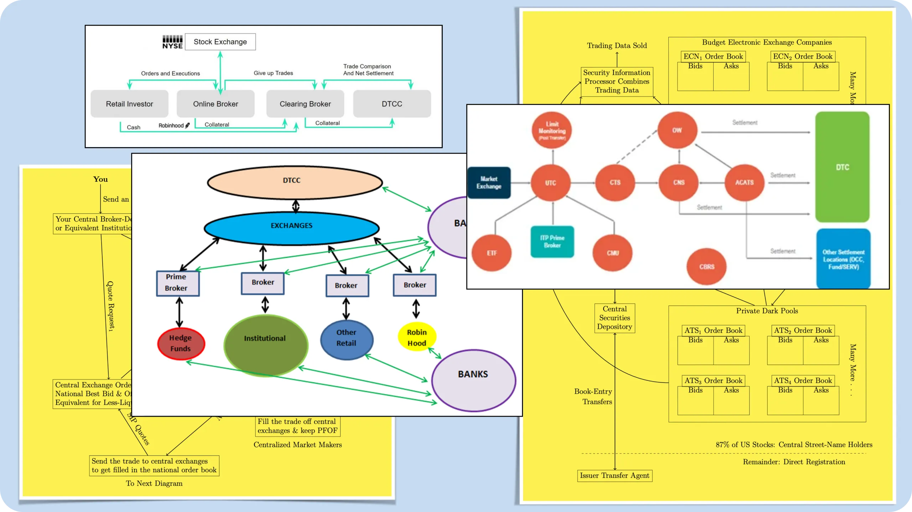

```
status: Draft
submit: 13 Oct 2024
dialog: https://github.com/stellar/stellar-docs/pull/723
```

Hi @silence48, thank you for the thoughtful review of that last js example draft! It's been an inspiring week per some stellar feedback from regulators and community developments. Working on those likely till Sunday, and I'll be back to respond to the specifics early next week. 🤝📅

As I'm writing this, I see someone out my window mowing yards on a riding lawn mower which must cost at least $5,000. Indeed, this professional works only to mow lawns and offer other such yardwork in the area. It's this longstanding specialization that enables exponential social progress, progress which can [too easily](https://teapowered.dev/posts/demoralization-capitalism/) be halted by monopolization.

It's in this context that I ask if we might further advocate for specialized open-source work? Namely, it's [our understanding](https://github.com/orgs/WhyDRS/discussions/1) that true sustainability for community members like yourself to just [do stellar work](https://tyler.yak.farm/personal-ZS5pWDdaYXZHeHVqUEZ3aGpPWmNRczl1bEhrYnZpejNJMm15cnQ1a3l1eXMxTjlLY05qYQ/how-to-make-more-money-c3dGbU81RVBPQVprT1BHU2FUY2xI) and receive fair compensation. It's in this context that I'd appreciate the opportunity to share some thoughts on decentralizing our documentation, the very tool which widely introduced me to Stellar in the first place.[^cb]

[^cb]: After watching the inaugural [Lumenaut videos](https://www.youtube.com/playlist?list=PLWUFvhKuc_5u1sQsz-FAmRgFf9HEhyqj-) through Coinbase Earn in 2017, making [some trades](https://wooten.link/scam), and reading the [whitepaper](https://whitepaper.io/document/2/stellar-whitepaper).

# 1. Initial Reactions

Your brief review points bring up some material background which seems relevant in the context of this PR and other discussions or issues previously referencing it. Accordingly, might I share my overarching thoughts about the specific items you brought up? 💬 Namely, I am not and do not consider myself to be a coder.

All of the production applications I've written are in Python, which is why I mapped out the basic premise like that first. After that, I'm [onto ChatGPT](https://chatgpt.com/share/670bd0da-d364-8010-8754-ae5035b50a37) and such to preliminarily translate the info as requested. 👩‍💻 I think there are some challenges on that side because it doesn't seem to understand how Go account address resolution works&mdash;something I understand you've actually trained a model around for more accurate results in all languages.

Like other community members, I am much more of a writer and strategist, outside of my true call in asset management. And I believe these educational skillsets are crucial to widespread adoption of the network. Given the sunsetting of SCF education grants by my present understanding, might I share some more thoughts on the documentation, governance, and progress of Stellar? 🌌

# 2. An Abundant Network Opportunity

I think you more than anyone have seen firsthand just how creative our community can be given adequate resources. Particularly, it's my understanding that many projects solicit your consultation because of your active, generous, and timely support on Discord. 💜 The incredible reality of this work is that it enables specialization, a tool so crucial to efficient capitalist society.[^xdr]

## 2.1 Fostering Directness

Indeed, most of the challenges in this particular example come from an [unfinished draft](https://x.com/JFWooten4/status/1780623146724290616) incorporating the AI response into the page. However, I ran out of time that night, and just 'saved' my progress with an incomplete commit, per the added line spacing separation. 💾 In fact, I was quite struggling with the inheritance part, as that's something I've always had a tough time with in JavaScript.

I think we [build better](https://www.youtube.com/playlist?list=PL9SrRYIjnam2aIFOYuFj2jyGkaE7IQpFX) when everyone can learn, reference, and iterate on prior research. There doesn't seem to be any reason in my mind that composability ought disappear when we enter the realm of decision making, as is so often the case in mammoth policy releases from a select few middlemen. If we agree that anyone anywhere ought to be able to develop their problem-solving skills, might we develop a collective strategy to make our choices more open to public review? 👁️

Namely, it can be challenging to comprehend the operations of some stellar production applications based on their source code alone. Indeed, I intrinsically believe that the only way to end "back-room deals" is for all stakeholders to apply the "cleansing sunlight of transparency" praised by President [Barack Obama](https://sunlightfoundation.com/2013/01/22/a-decidedly-different-obama-on-transparency/). And in the sense of [open](https://github.com/stellar/stellar-docs/issues/864) [source](https://github.com/stellar/stellar-protocol/pull/1516) [free](https://github.com/JFWooten4/free-markets/issues/11) communities, well, that happens to be all of humanity. 🌍

## 2.2 Efficiency for the Impoverished

Low net worth is a temporary status, and I'm obsessed with how we might empower masses of people to change that state via Stellar.[^long-term-thinking] A couple days ago, I was looking to schedule some flights back home/to family for holidays&mdash;Thanksgiving in particular. I needed to confirm some times with my partner and such, so I waited till this morning to buy the tickets since she was at work.

But when I went back to secure my flight yesterday, the price for one leg increased by 80% just this morning. Comparatively, aviation [used to be](https://lnns.co/o1pmTaZBF2_) regulated down to a specific cost per mile, so as to promote equal access opportunities.[^air] Without an efficient American rail system, I'll indeed be at the whims of the oligopolies of how much of my rent savings go towards this particular trip, albeit at my fault partially for not confirming some family event dates earlier.

Thankfully, our diverse, brilliant, and hardworking community seems to fall on the more considerate side of this scale. 🫱🏿‍🫲🏻 Indeed, it's the dramatic [efficiency](https://sorobandomains.org/docs/limits_and_fees) baked into [native operations](https://github.com/stellar/stellar-protocol/discussions/1504) which so effortlessly empower the masses to employ the financial system, not the other way around via a [select few middlemen](https://github.com/stellar/stellar-protocol/discussions/1558).[^wallst] I find this particularly inspirational given the precedent of blockchain rent-extractors copying [major innovations](https://github.com/Uniswap/v2-core) for the sake of short-term profits at the expense of long-term sustainability.

[^wallst]: _See also generally_ discussions on the quandaries of central intermediaries in [Stack Exchange](https://stellar.stackexchange.com/questions/2096/how-does-stellar-manage-to-cut-the-cost-of-remittances), [Bitcoin Forum](https://bitcointalk.org/index.php?topic=108782.msg1182508#msg1182508), and [Core Protocol](https://github.com/stellar/stellar-protocol/discussions/1528). 💬

[^air]: _Compare_ mandated approval for airline routes upon the contingency that they [accepted less popular destination](HREF_THE_"DRAFT"_POOL) with the present shareholder-extraction model which [prioritizes profits](https://news.aa.com/news/news-details/2024/American-Airlines-reports-second-quarter-2024-financial-results-CORP-FI-07/) so much that they [extort cities for service](https://time.com/6247052/airlines-deregulation-american-inequality/).[^censorship]

## 2.3 Shared, Nonproprietary Market Upgrades

I wholeheartedly believe that only together do we stand a chance at freeing our markets from Wall Street's tight oligopolistic grasp. And if we elect to act in unison, it seems like we might just give investors the saving grace they didn't know they needed. Might we act collectively amidst this great [turning point](imgs/community-must-act-now.png) so that the next great financial system doesn't face the [quandaries of today's](https://github.com/stellar/stellar-docs/issues/1013)?

Indeed, if we are all sincerely "driven by technology that helps people to [truly own what is theirs](https://youtu.be/5wUhyR94rho)," then it seems natural that the network's documentation itself ought live at the whim of [the community](https://discord.gg/stellardev). Do you find this perspective particularly material, given:

> 99% of regular people don’t know that they don’t own a piece of all the companies they’re paying for.
>
> First they have to understand that, then they have to decide if they prefer convenience or ownership.
>
> — [6days1week](https://x.com/6days1week)

# 3. Ownership for All

As inspired by our community and deeply evident in the Network's design, might we continue advocating for the foundational promise of usable self-custody? It's my view that this mission starts at the core of our open-source advocacy, advancements, and accessibility. Namely, it's only when changes are [clicks away](https://github.com/stellar/js-stellar-base/pull/605) that the dispersed, impoverished, and developing citizens spread across this vast world might coherently collaborate towards our grander mission. 🚀

Do you think it's possible and worthwhile to engineer these free markets? Might the crowdsourcing ethos so evident in protocol development itself spread to the key responsibility of widespread education through the docs themselves? 📖 This is what I think of when contemplating your generous, unsolicited, and pertinent feedback, Silence.

[](https://deoccupywallst.com)

We're tackling an unprecedented common enemy with a unique ability to buy their way out of every past catastrophe. As someone that didn't attend Meridian [due to cost](https://discord.com/channels/761985725453303838/1275450859404267612/1282436597715042307), I believe so wholeheartedly that the unique community consensus methods employed by Stellar can sincerely replace their broker monopolies. Might we contemplate further how employing a regulation-aware development strategy could best serve us?

[^xdr]: _See, e.g.,_ initial instinct to learn the specific [xdr](https://github.com/stellar/stellar-xdr) [implementations](https://github.com/stellar/stellar-core) affecting transparent protocol amendments when starting [these thoughts](https://github.com/JFWooten4/free-markets/commit/95a8f2ff7ff124bcfeeee08da3af20089f4894f7). This puts specific understanding further up on my timeline despite the business reality that I will end up down this rabbit hole regarding discussions, defenses, and dialogue across industry. But don't you think the true division of labor fostering stellar protocol developments should and does come from remarkable community members like you?

[^censorship]: Since first joining the community, it has been abundantly clear that the "token listing standards" loosely associated with ledger spam (in a system which favors usability) revolve around the quandary of centralized trust in a select few middlemen who "approve" or "disapprove" what is or is not an acceptable asset, potentially based on the [liveness](https://www.scs.stanford.edu/~dm/blog/safety-vs-liveness.html) of such entity. Quite trivially, the extension of the argument presents itself in a number of pending litigations involving the U.S. Securities and Exchange Commission. If we might agree that upgradable smart contracts are so requisite to software innovation, do you think we should sacrifice this pillar of innovation for the limited application of democratizing market-making opportunities?

[^long-term-thinking]: _See, e.g.,_ a limited case presently facing masses of people which introduces, e.g., the conundrums of taking shortcuts _supra_ § 2.3, as expressed on a [permissionless basis](https://discordapp.com/channels/1102309240145707049/1102309240741310503/1295050690774696017). This innovative perspective was introduced to me by someone whom I do not know the real name of (we only know each other through online platforms, and they prefer pseudonymity).

Might we venture on the [path](https://discord.com/channels/761985725453303838/761985725453303841/1293804844196565002) [less](https://github.com/stellar/stellar-docs/issues/767) [traveled](https://github.com/JFWooten4/DRIP-fee-impact)? 🛤️
