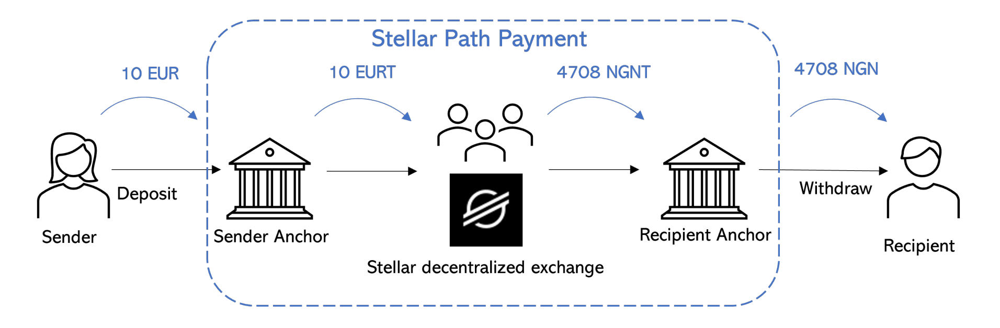

```
status: Draft
submit: 18 Nov 2024
dialog: https://github.com/stellar/stellar-protocol/discussions/1558#discussioncomment-10807798
```

Hi @rahimklaber,

Thank you for your thoughts, both here and shared on Discord. It was inspiring to hear via DMs how you got into the network, largely for humanitarian, real-world use cases. Over the years, I've found this to be a common thread linking us together.

In an effort to further these foundational principles that uniquely belong to the network, might I quickly review my own understanding of these ethos? Chiefly, I understand that the founders wanted a decentralized payments network that was cheap, fast, and inclusive, based on personal identity, not computing power. We seem uniquely adept at providing such a system given the lethargy, centralization, and gatekeeping present in other financial systems.

I'm writing this as someone who just wants the most efficient technology possible under our stewardship because I've felt so keenly the vast inadequacies of legacy markets for practically my whole life. They have ripped apart my family, taken nearly every drop of opportunity I've identified right out of my hands, and pulverized my aspirations as a mainstream asset manager.[^self] There is nothing I want more than for the network to succeed, and I believe wholeheartedly that we will triumph enormously over other technologies given the proper execution of scalable, decentralized, egalitarian markets.

[^self]: This is not a reply about myself, but I just want to share my openly disclosed "stake at the table." I have approximately $3,000 in both my checking account and Roth IRA; everything else is in [john.xlm](https://stellar.expert/explorer/public/account/GC5TUPFLOXCINDYHQVYYLLVYP6GKHT65ELB2Q2WLFTGN63YYIXPQTDFJ). I sold the vast majority of my assets three years ago for [$30,000](https://youtu.be/rbjFjda3_UI?t=4815), which I've been using to build the stock market on Stellar ever since.

# 1. Extensive Recent Community Actions

Since this post, quite the collective discussion has popped up on the subject. Perhaps most relevantly, you were rightly given accolades for uncovering the deadly bug.[^yays] 🎖️ The context under which this occurred is materially-relevant to the rest of this discussion, so I will link it here:

[^yays]: _See_ the [above post](https://github.com/stellar/stellar-protocol/discussions/1558#discussion-7245978) ("PREV") at n.3. _See also infra_ § 1.3. There might be some legal jargon sprinkled in here for the regulators that read it, but really this is about how we might best empower people like you to smoothly access liquidity.

[](https://youtu.be/KTH85egVSzw?t=388)

Also, we wouldn't have heard live about your expert white-hatting if it weren't for [Jayrome](https://discordapp.com/users/769062410518134874), who kindly reached out to community members to solicit AMA questions before the event. Jayrome relentlessly contributes their time, expertise, and consideration through open discussions, prudent facilitation, and [news aggregation](https://communityfund.stellar.org/project/lumen-loop). They did an unbelievably tremendous job asking with relevant tone-setting context from 2022, genuine tact for differing perspectives, and an open mind toward possible solutions.

I believe so earnestly that these open communal discussions are the secret instrument we can leverage to overtake entrenched incumbent interests. Indeed, might the optimal solution for these network-wide quandaries come from the artful, attributable, and permissionless Discussions we've already seen lead to stellar outcomes in CAPs [51](https://github.com/stellar/stellar-protocol/discussions/1435), [53](https://github.com/stellar/stellar-protocol/discussions/1447), and [56](https://github.com/stellar/stellar-protocol/discussions/1460)?

## 1.1 Previous Functional Mobile Advancements

Before diving into the nuances, I'd like to applaud your longstanding efforts to bridge different platforms to Stellar with [a single SDK](https://github.com/rahimklaber/stellar_kt). 👏 Too often, work might not see the light of mainnet despite the material efforts behind its development. But many of our long-term challenges can be overcome seamlessly thanks to those key thoughts, incremental improvements, and persistent bug fixes.

Empwoering usingers with a direct DEX wallet in the palm of their hand
Because today's centralized markets are so subject to the hack one pg the hacking part, with wallet on phone

Implicate very deeply https://www.youtube.com/watch?v=QafkIh2nvY0&list=PLWUFvhKuc_5vyAfq_AbWz-wSl82p_xtH9

https://x.com/JFWooten4/status/1815083374744334340

(FN) discuss the custody implications and href to the not you keys part and such in the nicehash arguments first introdiuced per [higher fees](https://discord.com/channels/761985725453303838/761985725453303841/1293775764830814350)
- corporate control
- custody implications
- arbitrary limits [discussed] in re _Compare_:
  - https://discord.com/channels/761985725453303838/761985725453303841/1293804598368145449
  - https://discord.com/channels/761985725453303838/761985725453303841/1293770598891389060

}}

As I've [tried to express](https://github.com/stellar/stellar-docs/pull/723#issuecomment-2410026689), I might not be intimately familiar with the particular nuances of JS/Native/JVM implementations and their core XDR (not Horizon)&mdash;just yet at least. But it's clear to see that you're making [ongoing progress](https://github.com/rahimklaber/stellar_kt/issues) on what just might be the next big community project. And it's quite inspirational for me, at least, to think that you're able to do all that on top of traditional work.

## 1.2 Introducing Communal Discussion and Quotes

Unfortunately, much of this [thinking work](https://github.com/rahimklaber/soroban_token_dao) can get lost in the fast pace of release schedules. In the spirit of documenting AMM design choices,[^pmes] I'll append some discussions from the [Stellar Global](https://stellarglobal.community) Discord. Namely, most of these messages stem from [shared concerns](https://discordapp.com/channels/761985725453303838/1292523643900919951/1301285580310839367) over a network participant's transparency, integrity, and liquidity governance influence.

[^pmes]: _See, e.g.,_ open discussions on key basic capitalistic tooling design [approach](https://stellar.org/blog/developers/the-principles-behind-protocol-design-amms-stellar), [reasonings](https://stellar.org/learn/swap-functionality-and-amms), and [implementations](https://stellar.org/blog/developers/liquidity-liquidity-liquidity). _Relevantly,_ these developments occur in the open across our network ecosystem, not siloed away in the depths of some corporation. As someone who believes deeply in [Conway's law](https://www.youtube.com/watch?v=BDagiC8Sw48&list=PLWUFvhKuc_5uIHno6ZC1QA3jKhvI9rVXU), might the best approach to a decentralized, liquid, and open market be one in which all efforts come from transparent community collaborations?

### 1.2.1 Adam: Trading Execution Materiality

Rahim [said](https://discord.com/channels/1172621167400599582/1172621168197509137/1291850276646551653): "if we have enough liquidity onchain then interleavin the amm and sdex wont' make much difference"

> what really attracted me to stellar is the sdex order books. once you add an interface, it suddenly feels like stellar has centralized orderbooks.. the stellar sdex orderbooks creat and offer the most free market this world has ever seen...
> the orderbooks on the sdex give EVERY asset on the network a starting point and reference for price. having this time tested and trustworthy reference point provides an adavantage  to every asset in its search for fair value. this advantage is unseen on other networks.
> 
> &mdash; [adam.xlm](https://discordapp.com/channels/761985725453303838/1302004423483981924/1304772394828828712)

> without the sdex isnt stellar just another smart contract blockchain...
> like what makes it special once yo ditch the best part?
> no chain has anything like the sdex orderbooks...
> the sdex orderbooks are still more advanced than any set of orderbooks on any chain. and we still have just enough volume in the sdex to prime the pump for an insane surge of liquidity
> &mdash; [adam.xlm](https://discordapp.com/channels/761985725453303838/1302004423483981924/1302004862170435674)

> the entirety of the sdex amm's provide the market participants with a reasonable aprroximation of the the fair value of the assets in the whole of the system. amm's compliment the orderbooks and vice versa.
> 
> it is a whole organism now. an entire economy has developed inside the sdex. it is the reference point of fair value for anyone attempting to use the fragmented liquidity on soroban.
> 
> we have black boxes providing prices on soroban that are far from the value derived by the trusty sdex. the sdex is a strength of stellar and should be utilized to roll out the soroban economy in an orderly fashion. it gives an opportunity for intrachain arbitrage that is unseen in other chains.
> 
> &mdash; [adam.xlm](https://discordapp.com/channels/761985725453303838/1302004423483981924/1302311486240329800)

### 1.2.2 @ddombrowsky: Order Book Independence

> One other thing to consider: why would stellarx implement the api to trade tokens on the new soroban aqua exchange?  Taking the "D" out of the DEX definitely seems like a step backwards...
> the horizon API gives you everything, not just the tokens that aquarius decides are important.  For example: where can I find the simple UI to swap blend and usdc using the comet pool?
> &mdash; [aLatvian](https://discordapp.com/channels/761985725453303838/1302004423483981924/1304657143466557482)

> Case in point: the 1inch dApp is blocked in all of the US of A.  If amm and dex moves off of stellar core, you should expect nearly all site-specific implementations of these features to be blocked in the US.
> 
> &mdash; [aLatvian](https://discordapp.com/channels/761985725453303838/1302004423483981924/1304657143466557482)

> Right now, I can place an order on a thin orderbook and it might be filled if there's a path payment through it at that price.  Without the amm, I'd have to rely on just the volume in that pair, or maybe someone who happens to be running a bot against some soroban pool somewhere.
> There's also the fact that in ALL other chains, if I want to swap, I need to go to one site that runs a good UI for one pair into a common token (eth or op or sol or whatever), and then at least 1 other site to get to what I want.  Expensive, slow, and annoying.
> 
> &mdash; [aLatvian](https://discordapp.com/channels/761985725453303838/1302004423483981924/1302064708035154000)

### 1.2.3 Active Competative Differentiation Work

> I'm interested to learn what the fees on soroban will be when adoption grows. Stellar classic fees make fee sponsoring very doable and also allow for low value transactions. The latter I really can't judge yet; soroban be just as efficient in terms of fees as the dex is for conversions of low amounts? 
> 
> &mdash; [Wouter](https://discordapp.com/channels/761985725453303838/1302004423483981924/1305172585788735488)

> We already have tech no other chains have since years. What is needed, not just in Stellar but in the whole crypto bubble, is to actually build things for people out there. Look at the current financial system, it's bloated, slow, old and everything.
> 
> &mdash; [tupui.xlm](https://discordapp.com/channels/761985725453303838/1302004423483981924/1305670913898975292)

{{ ^ segue this guy (sole Tup ref) into the above argument from Garand on building things other than LP venues:  
"I am talking about the rest of the world who litterally does not care about the tech stack and just want real usage. And AGAIN, crypto is NOT just for finance!"}} (on the name?)

> At the Meridian round table, I chatted with a bunch of the soroban devs to try and figure out what their needs were wrt soroban DEXs...
> To be clear this is early stages, which is why I wanted to open the conversation at Meridian. Ideally, we'd have something where both soroban and classic could use the SDEX orderbook and both classic AMMs and Soroban AMMs could use SPEEDX as a shared "backend"
> 
> &mdash; [Garand (SDF)](https://discordapp.com/channels/761985725453303838/1302004423483981924/1305123502369538171)

{{ Adam voiced that it's "the coolest creation in crypto in the last 10 years," which comes back to the thesis part.

1.2 very briefly into public background shared around origination acc EA.  
See unproductive net social expense of arbitrage as shown in central rents from trdes executing in [dark pools](https://x.com/JFWooten4/status/1842296919160144159) per genslar off-exchange
}}

## 1.3 Appreciated Thought-Provoking Perspective

Again, I'll call into light your stellar past technical work expanding the ecosystem's toolkit. I'm continually impressed by both your comprehensiveness and deployment skills, whether it's expanding on trailblazing [contract streaming](https://github.com/rahimklaber/SStream) or creating a brand new [account servicing](https://github.com/rahimklaber/stellar-accounts-as-a-service) project complete with its own permissionless documentation. And to think much work here started just four short years ago with an intuitive [tokenization offering](https://github.com/rahimklaber/galactic-wizard)&mdash;just incredible, Rahim. 👏🏽

Given this deep technical background, I'm all the more impressed by your continuous community outreach. Not only have you found bugs such as your [community contribution here](https://3649863591-files.gitbook.io/~/files/v0/b/gitbook-x-prod.appspot.com/o/spaces%2F5QUy59hBUnouBhx8gNSS%2Fuploads%2Fim9FzKJwsLFzwC9fl2sV%2FAquarius%20Vulnerability%20Resolution%20Report%20-%20Potential%20Duplication%20of%20LP%20Rewards.pdf?alt=media&token=3f4323ba-6249-4c7f-9c6e-a8fa64ec519f), but you are also constantly in contact with developers and users alike to address concerns! Having recently discovered the thread myself, it was awakening to read your conversation with Adam about recent flaws in another Soroban AMM that centralized control of deposited liquidity into a select few hands.

Especially on other chains, some industry participants prioritize crafting a good story to sell to investors for some easy initial funding. 📊 When these developments lead to material losses in freedom, security, and money for users like us, it's both refreshing and uplifting to know that your skills serve to defend the peoples' interests. We're all just trying to make this work as we go along, and your behind-the-scenes passion energizes! ⚡️

# 2. Enabling Trusted Global Liquidity

Part of Stellar I find so incredible is the heavy lifting done by community validators behind the scenes. The diligent and selfless contributions bring accessible transactions to all. In this light, I [originally](https://github.com/JFWooten4/free-markets/commit/9b8c125b955594c1d73d1ace031146f9588a05fa) wanted to have our own nodes spun up to try testing for the simulated ongoing execution burdens.

Part of the reason for this logic is that I don't want to sit here asking for something for nothing. Namely, I'm only a motherboard, CPU, and NVMe drive away from getting things spun up.[^test] But that's presently outside my scope of operational capabilities across organizations per survivability constraints _supra_ note 1.

[^test]: I particularly want to mimic some of the original SPEEDEX paper's results on a modern Threadripper. With some actual data, I can more meaningfully contribute to the conversation going forward. Albeit the precise configuration work is outside my maximal area of expertise.

That said, can we all agree that the contemplation given to my beliefs ought to be weighed independently of my present socioeconomic standing? As I've tried to shortly capture, the beauty of the network really shines when it shares the best industry tech with all classes of society. Could introducing "loyalty tiers," as is so common on central exchanges, run counter to the ethos that genius can [come from anyone](https://lnns.co/ZT-4HtxlXVK)?

## 2.1 Enduring Network Design Perspectives

Expanding on the chief question asked in the video from Meridian,[^ngr] might we take a holistic consideration as to the cost of liquidity as it stands today? As voluminous comments in the singular conversation forum so far have revealed, liquidity is a key aspect of the network for users, developers, and advocates together. Reflecting on the asked investment of time, energy, and composability into interleaving liquidity, might we consider the sum network benefits?

[^ngr]: Which is different from the [round table](imgs/comments/garand-offline-roundtable.png) Garand mentions. I reached out to @SirTyson for comment on Nov 1 but haven't heard back yet. In the same chat linked in § 1.2.3, they say SPEEDEX "opens the door to a lot of interesting opportunities, such as higher trade volume, better compatibility between Soroban and classic ops, etc."

Markedly, the choices we make around items like [whether or not](https://github.com/stellar/stellar-protocol/pull/1562) contracts call the DEX have significant downstream effects on whether the network runs well for users like us or the centralized institutions presently so dominant across other chains. I like to think there's a reason the large majority of demonstrably-compliant web3 investment products employ the network (or at least originally launched here). All this despite the current lack of attention on self-custody options available to all.[^cbn]

[^cbn]: _See, e.g.,_ the UI deprioritization of Stellar on the centralized exchange in note 7 of PREV, buried under every other supported USDC chain. _See also_ similar treatment in the Circle developer dashboard. These starkly contrast with the plethora of legal filings explicitly referencing the network behind the closed doors of legalese.

Might the self-custody implication inherent in existing exchange business models draw attention away from the DEX?[^s=c] This might lead to a number of quandaries that came up in this discussion, such as trading volume compared to proprietary venues, AMMs, and HFTs. I believe wholeheartedly in our unique opportunity to collaboratively explore the most efficient globalized solution that satisfies the longstanding needs of traders, developers, and innovators.[^nex]

{{
[^s=c]: ## Expanding the Locus of Trust

There are very legitimate centralization implications in upgradable smart contracts having their keys get hacked, as we see so commonly.

I know there is Soroswap (probably don't mention explicitly), which does this without upgradability.  
But this segues directly into the very foundational argument that any upgrade (and there will be upgrades _see Uniswap v3_) goes through the process of creating a new source of liquidity.  
The only way to fix this is to have it at the protocol level so that upgrades continue preserving the existing locked-up liquidity.  

This implicates making the argument against deposit locks as discussed on both sides of the agenda.
}}

[^nex]: I might not know exactly what will change about financial markets over the coming decades, which could materially impact the DEX's requirements. But I have deeply studied the history of markets over the past six years in an effort to understand what _won't_ change, no matter how many centuries pass. Can you imagine a future where developers demand wider spreads, traders want fewer ways to game the system, or innovators want to build whole businesses on delicate foundations?

This should frame as a collaborative effort to explore other options not revealed in my 1 vs. 2 hypothesis since there are so many incredibly-intelligent believers in the network with genius ideas etc. decentralized (this implicates the points made to Shaptic and adopted by in https://github.com/stellar/stellar-docs/pull/1043#discussion_r1811060899).

### 2.1.1 @jedmccaleb: Blockchain Liquidity Innovator

Might we emphasize Jed's brief remarks on the panel given their precedential history in markets, as shown by being one of three current footnotes in the [Wikipedia page](https://web.archive.org/web/20241112165049/https://en.wikipedia.org/wiki/Order_book) for order books? The particular footnote posits that Jed was the first person to develop an order book link plot showcasing market supply and demand, back when it was just them working alone on Gox. When asked about [their view](https://youtu.be/ZsiPqcyvDFQ?t=1244) from two years ago that "people love the DEX," Jed optimistically referenced the evolution of the DEX, telling Jayrome:

> The basic functionality still needs to exist within Stellar.

Can we agree that this steadfast commitment to form refreshingly positions the network in an industry where some leaders are so improperly influenced by Wall Street? Namely, might we best align with our mission to better humanity through the nonprofit nature of SCP combined with the decentralized governance it implies? While [alternative systems](https://lnns.co/zox1f6-_G4F) serve to enrich a select few, might we objectively ask what could best serve users, absent external business interests?

To bring this point to light, I [recently executed](https://stellar.expert/explorer/public/tx/2d32c9f6ea1baf2bf3fbe051346a42d8d1917c911aa4f4c171915cb0eebf910a) an offer to buy an asset from an issuer I like. However, a majority of the liquidity for this asset lives in Soroban AMM contracts, so I learned after later consultation. Might we jointly develop a scaling solution that doesn't incur at least 80% slippage?

### 2.1.2 @tomerweller: Seeking Efficient Replacement

Tomer seems equally hopeful for a network with more liquidity, trading, and access.[^t2022] My understanding of their perspective so far is a focus on composability between protocols built on top of the network. In the discussion, Tomer [said](https://discord.com/channels/761985725453303838/1302004423483981924/1302276394356703232) they didn't yet have much "to add on top of what was said" at Meridian.[^hack]

[^t2022]: _See_ 2022 remarks that "the order books are extremely efficient as far as order books go, but order books in general are not the most efficient data structure." Might I posit that we can still develop production applications in [Python](https://x.com/JFWooten4/status/1849109891471843764) despite the technical reality that Rust programs would run much faster, ignoring nostalgia _ab initio_? Perhaps marginal improvements here and there are less relevant given the contextual competition from [COBOL mainframes](https://x.com/JFWooten4/status/1843833900642320509) so common in the correspondent banking system?

[^hack]: According to further [conversation](https://discord.com/channels/761985725453303838/761985725453303841/1306590729098887231), this statement was made before the recent social account takeover. I find this point relevant because one of the first things the attacker did was send out mass ETH phishing links. Might we keep this in mind when discussing the incumbent architectures that follow?

I sincerely appreciate Tomer's experienced, meticulous, and transformative work throughout the ecosystem. That said, might we bound ourselves for material compliance violations using the two alternative options they propose, based on Soroban and presently in the incubatory stages of development?[^twos] We're all for a new visionary, collaborative, and dynamic system; by my understanding&mdash;building on the same team.

[^twos]: _See_ discussion on first and second options _infra_ § 3.1 and 3.3, respectively. Given the involvement of these systems in the recent [FBI Polymarket raid](https://youtu.be/tx6A3_OLEMY), might we take caution in the real-world liabilities associated with the exchange function. The present path of development could introduce material compliance risks to existing network projects, no matter their locale, given our SEP8-light implementation of book-entry securities.

But the core function of asset exchange implicates not only regulatory security but also practical custody risks which the previous surprise update acutely brought to light. Combined with the recent hikes in AMM "listing fees," might we contemplate further which path could best grow the network? Fees which, I feel obliged to remind everyone, are paid in speculative tokens for the vast majority of present implementations.[^nxlm]

[^nxlm]: These tokens are issued, controlled, and governed at the whims of central organizations operating on the network. Indeed, this discussion stemmed from material concerns over the influence one such network participant had over the DEX due to their concentration of tokens. Might we widen our impact by ensuring that, just as with payments, there are no central intermediaries able to control the most key social function of trade itself?

### 2.1.3 @rice2000: Community Collaboration Focus

From the original 2022 panel to today, Justin has stood firm as a neutral arbiter between Jed and Tomer's viewpoints.[^arch] It doesn't seem like Justin explicitly prefers any one route, based on limited in-person conversations, historic public info, and [recent statements](https://www.reddit.com/r/Stellar/comments/1ciiki3/comment/l3b0h24). These sentiments were also true by my interpretation of the 2021 [Open Protocol Meeting](https://youtu.be/aHZQfcIdmoQ?t=1214) adopting native AMMs.

[^arch]: Please do feel free to jump in and comment if I'm missing anything here, though. 😅 Relevantly, by "adopting" later in this paragraph, I mean taking the [CAP Core Team](https://github.com/stellar/stellar-protocol/blob/master/core/README.md#awaiting-decision---final-comment-period-fcp) poll, based on the open community contribution framework. Might we further discuss elsewhere the migration of discussions from the stellar-dev mailing list onto GitHub Discussions, as implicated in § 1 at links 4&ndash;6?

In conversation with the community projects Justin highlighted on [Reddit](https://discord.com/channels/761985725453303838/946921813143851019/1291438741747138560), developers believe trading needs to be the first Soroban use case because you can't call the DEX from contracts yet. But, as discussed, we can transform the DEX together to deploy infrastructure that doesn't overly burden a central point of failure. Indeed, Justin seemed to lightly nod when Tomer voiced that "another option" is "people like Garand" prototyping evolved order books implementing SPEEDEX.

Might we continue supporting parallelization, decentralization, and concurrent trade execution to "prevent liquidity fragmentation and arbitrage?" Garand is only one of many SDF members who's [voiced](https://discord.com/channels/761985725453303838/1302004423483981924/1306427216699068496) such concerns over needless extractive arbitrage.[^fragrr] After a crowd survey, Justin responded in 2022 with their thoughts on the most efficient path forward:

> I actually think having public discussions about controversial issues like: "where scalability verses the DEX&mdash;which one to favor?"

[^fragrr]: 
{{ ADR fragmentation, arb intrastocks

[^fragmentation1]: [quandaries_of_fragmentation.pdf](https://github.com/user-attachments/files/17347675/quandaries_of_fragmentation.pdf)
[^fragmentation2]: [Base asset differentiation](https://papers.ssrn.com/sol3/papers.cfm?abstract_id=1808269)
[^fragmentation3]: Synch the argument with the material difficulty of [reconciling segmented assets](https://github.com/user-attachments/files/17347723/inften__20200407094352_82382.pdf)

}}

# 3. Smart Contract Trading Systems

As I've [communicated](https://x.com/JFWooten4/status/1849109891471843764) with Tomer and [ecosystem participants](https://discord.com/channels/897514728459468821/907476473739354153/1263819898594005075) at large, might we design the evolution of the DEX using a "regulation-aware development strategy" (from [Sec 3](https://github.com/stellar/stellar-docs/pull/723#issuecomment-2410026689))? [Compliance work](https://x.com/BurCapital/status/1857504726159344047) takes many years of solid foundations, which Block Transfer has previously found in the steadfast, utilitarian, and resourceful network. Might we continue expanding on substantial past efforts to implement multithreaded batch trade execution?

As we will see in the next three subsections, the argument here is materially related to the never-ending debate of centralization vs. decentralization. But when applied to liquidity _itself_, we need a forcing function to an agreed-upon standard not dissimilar to the GPL. The chief difference between traditional "distribute wealth and power" arguments and fundamental markets is that anything other than a single venue enables wasteful arbitrage.[^furth-liq]

[^furth-liq]: Consider, e.g., the posited scenario of a rural Kenyan farmer sending Euros through string receive. How can that person expect fair execution if the European bank has some large amount of value locked away in a single (or even many) Soroban AMM-type projects? If all the central bankers vote to concentrate their "liquidity rewards" on Yen, will the Kenyan be unreasonably forced to route payments through unnatural venues?

In examining this question, I will present three common systems employed across lesser chains. These are the sort of arguments I can't really make in a formal filing given their derogatory nature, so I appreciate this opportunity to expand on these thoughts in a meaningful way outside of litigation. 💜 Could you consider reading these sections as if you were the new Chair of the SEC?

## 3.1 Off-Chain Order Book Systems

Our community cares greatly about order books because, as "inefficient" as they might be in data-structure analysis, **they form the basis of an efficient market.** There is no global financial system when each and every transaction relies on the goodwill of a select few.[^roths] Indeed, might the democratic, egalitarian, and accessible provision of liquidity best serve an increasingly decentralized society?

[^roths]: _See, e.g.,_ [banking implications](https://x.com/JFWooten4/status/1854915975247794213) at 1:18:20 demonstrated after the Chancellor was on the brink of second bailout for banks. Could these antiquated challenges exist chiefly because of the unambiguous tradeoffs implicit in the isolated, partitioned, and fragmented markets of yesterday? After fixing the conundrum of whom to trust via SCP, might we perhaps perpetuate Jed's founding vision of a single liquidity nexus?

I've believed in the DEX since the moment I understood SCP, [this video](https://youtu.be/YFca255hXj8), and Wall Street's exclusive club.[^cibt] And I believe with every ounce of my being that we're dooming future generations to continued exploitation by these bastardizing central planners if we fail to protect the last bastion of a free market present in the network. Here and now is our opportunity to fulfill Nakamoto's vision for a disintermediated base financial infrastructure, capable of the globe's payments, trades, and balances&mdash;not a select few.

[^cibt]: _See_ collaboration disclaimer at § 2.2 in [video](https://youtu.be/S75IvkicWD8) description. Both of us generally understood that "protocols" like 0x [could work](https://blocktransfer.com/.well-known/thesis.pdf#page=15) with cautious deployment, but time has proved that the developers thereof have consistently put profit over order execution efficiency. Might venture-capital interests needlessly introduce these explicit tradeoffs, inherent in a creditum system not optimized with the SPEEDEX advancements?

### 3.1.1 Unspoken, Silent Centralization Incentives

[](https://youtu.be/FEU9LoybzrU?t=397)

Pictured is an image from the present homepage of ZeroEx Holdings, Inc.; better known as 0x. [Here](https://www.sec.gov/edgar/browse/?CIK=0001828694) are their regulatory filings disclosing material venture investing for every year in the first three years of its existence. These filings detail how this corporation sold at least $84,121,200 to a paltry 45 investors at minimum, a significant sum of money that undemocratically shifts the power from Uniswap users to the corporation behind its development.[^tractionQ]

[^tractionQ]: The eternal problem stems from the reality that their revenue, popularity, and indeed sustainability comes from attracting ever-increasing trading volumes. This has been the path Wall Street has followed for millennia, presenting a [direct conflict of interest](https://youtu.be/YUwqzeaR1lA?t=63) with the [investing public](https://www.reddit.com/r/Bogleheads/comments/ug32km/can_someone_explain_to_me_what_revenue_from/?rdt=55563). Even if the "best" Soroban DEX(es) dominate the network with the most liquidity, the power over democratic trading stays in the hands of a select few [demoralizing](https://microstructure.exchange/papers/TME-paper.pdf#page=13) organizations.

The public fee schedules available from 0x[^lolf] reveal take rates starting at 0.15%&mdash;conservatively.[^match] These are not expenses passed on to a decentralized group of liquidity providers. And they are not safeguarding fees built around investor protections of regulatory frameworks _in toto_.

[^match]: _See_ _infra_ note XYZ [^hidden-fees].

[^lolf]: Which are paltry at best aside from digging into smart-contract code. _Compare_ these lax disclosures to the extensive public availability of pricing data from any number of traditional financial intermediaries. _See, e.g.,_ SEC-mandated Form 606, ATS, and 19b-4 reports letting investors know what fees they internalize.

These are economic rents siphoned off to a select few groups of early investors who were lucky enough to capture the immense value of liquidity singularities. And it is precisely this centralization that allows them to force transactions through the complex intermediated frameworks necessary to most efficiently transact on _their_ system. Should we really let our freedoms, governance, and oversight stay in the manipulative hands of these centrally-controlled middlemen?

### 3.1.2 Unspeakably-Efficient Path Handling

No matter how you slice and dice your interpretation, Rust in the execution environment will never operate as fast as validators' C++ logic. This presently enables the unbelievable efficiencies of 6-hop order routing without a central party. Might this unique differentiation of the DEX best allow us to compete with monopolistic, entrenched, and stagnant incumbents' domineering grasp on global financial liquidity?[^gwin]

[^gwin]: _See, e.g.,_ the natural emergence of competing centralized liquidity venues when able to [naturally compete on price](https://reports.tiger-research.com/p/onchain-darkpool-eng) through external incentives such as negative prices with [PFOF](https://youtu.be/XLc4c7vL3rM?t=5183). Perhaps this law is best exemplified through the [emergence of Instanet](https://github.com/user-attachments/files/17347641/instanet_history_comic.pdf) using a small computing framework to compete with global monopolies. Given our unique opportunity to start with an existing egalitarian system, might we continue pushing towards the financial standard for conversions?

I will go on to compare this opportunity with the present system which [continually faces](https://www.cftc.gov/PressRoom/PressReleases/8774-23) material regulatory scrutiny. Might the only way to maximize capital formation, efficient markets, and investor protections be to design a system which fundamentally disallows centralized censorship of specific items deemed inappropriate in the legacy regulatory context? This idealistic future, originated in the founding vision of Stellar, exists only in a distributed trade execution environment.

The only way to mimic this efficiency in the status quo is to consolidate all recordkeeping into a single entity. This powerful overlord can thus know all information, theoretically offering the most efficient system. But we've seen this gatekeeping develop firsthand through the [monopolization](https://papers.ssrn.com/sol3/papers.cfm?abstract_id=3885194) clearly present in America's DTCC, and it's not pretty.

### 3.1.3 We Are Not Ripple

In the BFT world, benevolent dictators unilaterally decide exactly who starts off with power. And in a mathematical system as complex as the market, these initialization conditions have profound long-term implications. Might we step back and ask ourselves if it's worth deviating from the ingenious course we've been charting together for over a decade?

Should we burden the network with spam due to "someone who happens to be running a bot against some Soroban pool somewhere," as aLatvian said? Or should we protect our existing implementation in Stellar Core, obviating the needless localization of functionality as basic as cross-border exchanging payments? Perhaps create a just society where we might share the natural abundance afforded by liquid markets and their implications?

There's a reason "ALL other chains" face the material operational limitations presently un-afflicting the DEX.[^cite] Should any meaningful volume shift hands into Soroban venues, we risk seeing the network's good name getting smeared in the legal ambiguity of a Wells notice.[^exam] Is this the fate Jed envisioned when they [wrote](https://github.com/stellar-deprecated/docs/commit/40dcdd5f7694afe8e0a80744be050fb619b690aa#diff-33f8136fb62b58edc1ba95991ceab5575eaac61855583bba45c60121990a8709R42):

> Imagine a world where, anytime you travel, you never have to exchange currency except at the point of sale. A world where you can choose to keep all your assets in, for example, Google stock, cashing out small amounts as you need to pay for things. Cross-asset payments make this world possible.

[^cite]: _See_ David at _supra_ § 1.2.2. _See also_ institutional adoption of the DEX as a native offering book in registered offerings. Might we inspire the rebirth of IPOs by supporting the [documented](https://developers.stellar.org/docs/tokens/control-asset-access#issuing-and-distribution-accounts) application of issuing an asset by creating an offer?

[^exam]: In numerous encounters with traditional web3 pioneers on [other chains](https://x.com/JFWooten4/status/1778787218041032865), I have repeatedly brought up the [many nuances](https://lemmy.whynotdrs.org/post/1166651) of offering regulations. However, they rightfully choose to ignore the consequences until their operations are so large that [regulators "attack"](https://www.sec.gov/securities-topics/crypto-assets) their communities, acting as trust arbiters in a central schema. If we truly aim to take down the inefficient financial system once and for all, might we continue treading toward a truly decentralized DEX?

## 3.2 ZK Scaling and Rollups

My [original implementation](https://github.com/blocktransfer/TAD2) of a stock market was designed to scale with optimistic rollups, as they're an easy answer to the scaling question plaguing less efficient blockchains. Another option, [zero-knowledge proofs](https://youtu.be/PIFclL2EE9g), offer similar promises. Admittedly, this is not my area of expertise by any means.

But I know markets, and the fundamental problem we ran into with these systems is that they require an order book which lives somewhere other than on-chain. The latter case often requires contracts to both simplify and propagate complex off-chain math. These abstractions create the unholy mess of a market present in the U.S.[^mk]

The power of longstanding Rust contracts is undeniable, per Garand's sentiments. We're at the start of an unparalleled journey to build an innovative financial system that actually serves the needs of its users, not its executives. Might we move past the elementary applications so common on other chains which we have already efficiently solved using validator-level logic?

[^mk]: _See, e.g.,_ routine complexity in § 2.2 of PREV. _Compare_ convoluted routing which developed over half a century with elegant simplicities promoted by direct pairwise liquidity pools in CAP38. Might innate routing efficiency drastically simplify the process of building dApps on Stellar? 🌌

[^es]: _See, e.g.,_ transaction from § 2.1.1, a fraction of institutional volume. Upon consultation with Enrique, this was the most anyone paid for the asset by far. Should we silo liquidity in contracts, making it sparingly available to specific users through certain frontends?

## 3.3 "UniV4-Style" Future Development Pitfalls

Throughout the conversations, we've all generally agreed that "the SDEX order books are still more advanced than any set of order books on any chain." Indeed, in my view, Uniswap V4 is just a mechanism to cope with the reality that other chains are not efficient enough to offer limit orders, falling back to the [systemic risks](https://youtu.be/dk3AVceraTI?t=1704) of [central netting](https://assets-global.website-files.com/64f99c50f4c866dee943e165/650c3f1413e3fb7a3c96e640_Understanding%20Uniswap%20v4.pdf#page=4). ⚠️ If we are to replace the mammoth intermediaries gatekeeping the financial system, we cannot ignore the fundamental need for priced offers.

[^add]: _See, e.g.,_ Adam's remarks in § 1.2.1. This truth remains as abundantly clear to me now after three years of compliance work as it did when I first understood the network. There is a reason every other order book operation at meaningful scale (e.g. past #5000 on CMC) receives a nice visit from a three-letter agency, including "DAO-based" ones like Tornado Cash.

Markets are not continuous functions like an AMM pricing curve. They do not follow your rules no matter how many times you run them through a Monte Carlo simulation.[^maths] As I presently understand these V4 contracts, they attempt unsuccessfully to tame the exposure participants face as the market moves against them, a natural uncertainty in the business of making a market for a spread.

[^maths]: _See, e.g.,_ the collapse of the "technically-accurate" [LTCM fund](https://www.pbs.org/wgbh/nova/stockmarket), [GME shorts](https://dollarendgame.substack.com/p/gamestopped), and [WTI turnover](https://www.bbc.com/news/business-52350082). _See also_ a plethora of "six sigma" events perpetuated by "black swans." To paraphrase the man who created the SEC, the only thing we can be certain of is uncertainty itself. 🛡️

The further down this path of control you center, the closer you get to today's market infrastructure. Pamphile explained [the material challenges](https://x.com/gttyson/status/1844446137408946680) exceptionally when they wrote, "it's bloated, slow, old and everything."[^tup] Can we really centrally control something as complex as markets themselves?

[^tup]: _See_ Tupui at _supra_ § 1.2.3. Other community members have asserted but not proven that long-tail illiquid, unregulated, and trailblazing assets are better off on AMMs. However, could this enforced trading policy unintentionally limit the free-market price discovery mechanism so efficient in today's long-tail equities?

### 3.3.1 Constitutional Corporate Overlord, Investors

As is made abundantly clear in [this response](https://blog.uniswap.org/wells-notice-response.pdf#page=8) to their SEC investigation, Uniswap "Labs" is a [for-profit C corporation](imgs/comments/uniswap-labs-entity.png) with "leading U.S. institutional investors, such as Paradigm, Andreessen Horowitz, and Union Square Ventures" and "more than 100 employees."[^mfers] This document also highlights that the enterprise has kept its algorithms under the oppressive protection of rent-seeking [software licenses](https://github.com/orgs/WhyDRS/discussions/1).

[^mfers]: _See, e.g.,_ their [legal mandate](https://en.wikipedia.org/wiki/Dodge_v._Ford_Motor_Co.) to maximize profits for shareholders, as upheld in the Supreme Court. _See also_ the formation of a "Foundation" five years after Uniswap's parent company was incorporated. Why do you really think they started following SBF's "effective altruism" [peddling](https://www.sec.gov/comments/s7-15-23/s71523-301019-767522.pdf#page=25)?

I am in no way whatsoever implying that similar business practices might emerge over the years from existing network participants. But even if the ecosystem's Soroban developers adhere strictly to the nonprofit principles embedded in SCP, they'll still be targets for regulatory action the moment they touch absolutely anything we're building at Block Transfer. It was also discussed that the SDF could deploy "definitive" Soroban AMMs to centralize liquidity, but this would very unambiguously place the Foundation in the crosshairs of similar threats.[^conv]

[^conv]: I have communicated this view with multiple SDF staff members over the years, including in the judge-only notes of our third [SCF application](https://youtu.be/UzLCQaJ-TqU). The underlying _funding_ of an exchange venue is categorically different than the _operations_ of root protocol rules. Indeed, this is precisely the paradox I ran into when I originally tried to position the Syndicate itself as a "stock transfer protocol," rather than the TAD3 compliance layer.

The stakeholders in today's systems are and have always been investors and issuers. Might any other party involved in the exchange process [exclusively serve](https://youtu.be/HQZg0ZY-Amg?t=2353) to siphon value away from those two groups? Should we defend the DEX as the last bastion of a free financial market?

### 3.3.2 Unacceptable, Unaccountable Execution Centralization

Along the path of centralization, incumbents try to sell "faster access" as a "trading benefit" to investors. However, if we're truly designing a global (and ultimately interplanetary) financial system, at some point we're going to run up against round-trip propagation time of digital signals.[^ciddf] This is exactly what Uniswap Labs' latest "invention" has introduced through the Unichain POC.[^garand]

[^garand]: _See_ [vague whitepaper](https://docs.unichain.org/whitepaper.pdf), especially requisite sequencer limitations in § 3.1, centralized offline compute in § 3.2, and explicit liability assumption in § 3.3. Could these "innovations" still be light years behind SCP's trust decentralization mechanisms? Or is their flawed use of [trusted execution environments](https://x.com/gttyson/status/1844445777114038761) a speedy central control mechanism we should also strive for?

[^ciddf]: As I understand it, this is about two seconds. _Compare_ the base agreement timeframes across any Network peer with the present efficiencies of locally computing paths on shared variables. Might a further specialization of select order batches best serve an increasingly asset-abundant ecosystem?

I say "invention" because absolutely nothing here is new. I could sit down and list dozens of regulatory filings which detail these exact exchange changes across the American securities landscape. The points at which certificates, settlement, and reporting became centralized come to mind&mdash;leading to the ultimate endgame of massive profits paying out to Silicon Valley over Main Street.[^sads]

[^sads]: The endgame of this path also implicates American legislature of the final "crypto market," as this is the only way to hold central institutions accountable when they serve the public at large. Of course, the "market" will be just another trading venue for Wall Street's power brokers to mimic, bloat, and exploit for huge returns. Could we be doomed to repeat yesteryear's sins so long as there exist central parties involved in exchange?

Given America has the world's most advanced, developed, and liquid market for capital, might we learn from the pitfalls of Wall Street? If we can right their wrongs, perhaps we can free ourselves from the shackles of a select few financial intermediaries. Shackles which have so poignantly determined entire directions of progressing nations. 🕌

### 3.3.3 Requisite Insurance for Adoption

I've spent the past four years talking to just about every anchor, trader, and regulator I know about blockchain. Following the prior logic, institutional adoption of actual trading on a self-custody basis requires gargantuan insurance products when using bootstrapped smart contracts, which we very clearly see pose hazards per your work. Could trading be the most important aspect of a financial system that we are presently left to master?[^imps]

[^imps]: _See_ ongoing fund clarity work, both internal and opened on Syndicate GitHub repos, _in re_ note 9 in PREV. We respectfully submit to the network that you do not get a "second first impression" with regulators, especially given the tacit but not contextual background of Jed.[^interop] Are the relatively modest profits a select few developers enjoy by arbitraging Soroban AMMs worth giving regulators a bone to pick with us, _ad infinitum_? 🏛️

[^interop]: For example, would not specialized financial instruments compose the utmost confidence in the liquidity pool transfer mechanism at a protocol level, allowing new institutional applications? A material aspect of compliance work involves regulatory reporting, recordkeeping, and analysis. Perhaps we might offer overseers the most transparent information possible as presently empowered by native execution result codes?

Everyone generally wants to move fast when it comes to launching into a sustainable business state&mdash;completely understandable.[^easya] But might it be prudent to [slow down](https://www.blocktransfer.com/about/values) and build something longstanding to serve generations of users to come? At Meridian, Tomer posited that:[^bug-20]

> There is no certainty. At the end of the day, it doesn't matter how many audits you go through; it doesn't matter how much testing you do. Sometimes there are bugs.

[^easya]: _See, e.g.,_ various developer discussions about the relative ease of deploying a new pool with a custom stableswap bonding curve or multi-asset pool composition for "diversification." Might these capital allocation quandaries necessarily exist in the market, solvable chiefly and simply by proper native balances incorporated into a higher optimized system? Perhaps the capable core developers and ecosystem participants could trivially implement new curves as needed but not satisfied by passive sell offers, should sufficient aid emerge.

[^bug-20]: _See_ _infra_ note XYZ [^maths] _quo videtur_ we are all in agreement. But I do not think the most basic of core infrastructure should require scores of bug bounties to attain modest credibility. Maybe the community's safety approach showcased in the [Soroban update delay](https://youtu.be/rbjFjda3_UI?t=7080) can be our guiding light to "take a minute, do things slow, do them steady, do them the right way from the onset, and fix the bug." 🐛

While we in the DRS community appreciate that there will be bugs in any computer systems, we'd prefer our funds not be at risk in flash crashes perpetuated by complex trading infrastructure. 🫤 Would it be best to strictly apply an unwavering software mindset to something [as important](https://stellar.expert/blog/tiny-things-matter-or-detective-novel-featuring-stellar-dex) as markets? Or might we conceivably best serve the plausible needs of our expanding ecosystem through a [feasible uniform front](imgs/comments/collective-network-benefit.png)?[^groups]

[^groups]: _See, e.g.,_ open protocol upgrades facilitated through [public discussion](https://www.youtube.com/watch?v=wcjzKdo0xS8), [comprehensive analysis](https://www.youtube.com/live/aHZQfcIdmoQ?t=1067), and [iterative disclosures](https://stellar.org/blog/developers/amms-in-the-stellar-ecosystem). _Compare_ the collective growth of such an important network function with the singular gatekept product-development approach employed across largely identical Soroban AMMs. Perhaps more concerningly, _see also_ long-term natural supply-and-demand constrainment when upgradable underlying structures [rely on an entity](https://x.com/JFWooten4/status/1853607712111624481) operating the order book itself.

# 4. Legal, Composable, Community Solution

[](https://papers.ssrn.com/sol3/papers.cfm?abstract_id=4550837)

Since understanding its deep humanitarian implications, I've bet my entire career that SPEEDEX works, and that it works stellar. Without true offers on the DEX, I see no future using today's technology in which I'd like a stake in this industry.[^works] Do you think Wall Street's time is up, as do the thousands of members in our grassroots community afflicted by their unadulterated theft? ⌛️

[^works]: For time, I will omit further contemplations on [design principles](https://gist.github.com/JFWooten4/827e423f6d3f2f43801602d81d6adbc0) _in re_ prior [public discussion](https://groups.google.com/g/stellar-dev/c/GPjHIYPdud8/m/S6mFvpgaAQAJ), _quod erat_ appreciatively incorporated into CAP45. 🫱🏼‍🫲🏻 [Tomer established](https://discordapp.com/channels/761985725453303838/1302004423483981924/1302262610409951275) that "you can't call classic order books from Soroban." Might we first "put a lot of effort into that" to rectify this limiting plight, since contracts share the root account infrastructure to hold classic assets?

Markets have proved time and time again the immense necessity of limit orders as the base building blocks of liquidity for the tens of thousands of long-tail assets issued on the network. The proven DEX is anything but the black box pictured above, which is explicitly not the case for smart contracts, aggregators, and frontends.[^hidden-fees] Might a tenable investment in efficient markets today serve the network's issuers for all eternity?

[^hidden-fees]: _See, e.g.,_ 0.15% [ZeroEx](https://0x.org/post/building-in-the-open-0x-pricing-update), 0.25% [Uniswap](https://support.uniswap.org/hc/en-us/articles/20131678274957-What-are-Uniswap-Labs-fees), and 0.25% [Matcha](https://0x-website-downloads.s3.amazonaws.com/0x-Monetization-across-DeFi.pdf#page=13) online execution expenses, materially ignoring gas. The requisite siloing centralization showcased here runs antithetical to [free markets](https://discord.com/channels/761985725453303838/761985725453303841/1295912752027664424). All furiosity aside, these are fundamental flaws in the endgame of these contracts, not the fault of talented developers like @earrietadev who have shown exceptional humanitarian consciousness by pivoting projects away from [wasteful mining externalities](https://discord.com/channels/761985725453303838/946921813143851019/1279941567515459606).

Could a truly nonprofit financial system built for its users minimize rents, as [discussed](https://discord.com/channels/761985725453303838/1292523643900919951/1294381549072154746)? Or, as in the immediately succeeding message, will we continue to be handcuffed to titanic arbitrary capital requirements to bootstrap liquidity?[^explore] Should the most performant trading system really frequently require at least three operations to min/max the pathfinding algorithm?

[^explore]: Might we contemplate the longer-term thinking that makes Stellar work so foundationally well across developing global nations? Should we force tomorrow's innovators to sell themselves into a system that extracts their passion to sustain liquidity DAO rewards, listing fees, and central development? That's not a network I'd like to be a part of expanding, given such a dire need for a system that puts us all [on the same playing field](https://youtu.be/5wUhyR94rho). 🗺️

It might be hard for technical people like us to see some of the incredible implications of a 50 bps spread reduction.[^pennies] But these innovations truly change people's lives&mdash;I've seen, felt, and shared it firsthand. In an increasingly abundant society in raw compute terms, might we best empower all network users with tooling that places the locus of economic control squarely in their hands? 🤳🏼

[^pennies]: _See, e.g.,_ the billions made weekly through Wall Street exchange skimming using [riskless theft](https://www.linkedin.com/pulse/gamestop-first-successful-short-squeeze-john-wooten-xvyne) of retail dollars through net-detrimental social-class exploitation. While a few cents today might look like peanuts, imagine what a difference to your retirement portfolio just an extra couple of bucks collectively in lumens would make, e.g., not three short weeks ago. These details are what's at stake when it comes to eliminating the hidden costs of centralizing PFOF, excess gas, and [poor execution](https://discordapp.com/channels/761985725453303838/1302004423483981924/1304786314092347566) that so commonly serve to the detriment of long-term investor savings and retirements.
