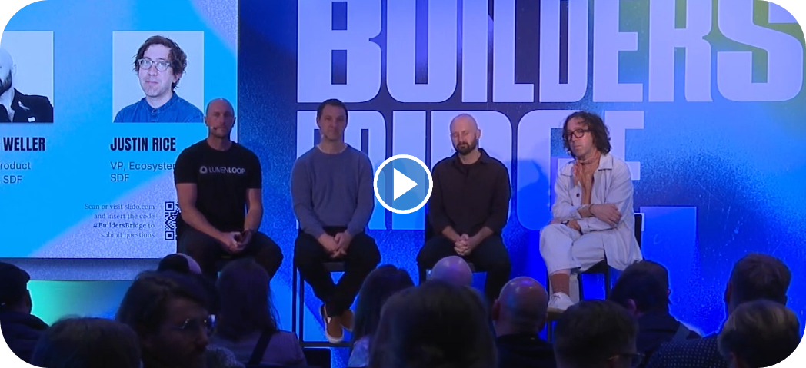

```
status: Draft
submit: 14 Nov 2024
dialog: https://github.com/stellar/stellar-protocol/discussions/1558#discussioncomment-10807798
```

Hi @rahimklaber,

Thank you for your thoughts, both here and shared on Discord. It was inspiring to hear via DMs how you got into the network, largely for humanitarian/real-world use cases. Over the years, I've found this to be a common thread linking us together.

In an effort to further these foundational principles that uniquely belowng to the network, might I quickly review my own understanding of these ethos? Chiefly, I understand that the founders wanted a decentralized payments network that was cheap, fast, and inclusive based on personal identity, not computing power. We seen uniquely adept to provide such a system given the legarthy, centralization, and gatekeeping present in other financial systems.

I'm writing this as someone who just wants the most efficient technology possible under our stewardship because I've felt so keenly the vast inadequacies of legacy markets for practically my whole life. They have ripped apart my family, taken nearly every drop of opportunity I've identified right out of my hands, and pulverized my aspirations as a mainstream asset manager.[^self] There is nothing I want more than for the network to succeed, and I believe wholeheatedly that we will triumph enormously over other technologies given the proper execution of scalable, decentralized, egalitarian markets. 🫱🏻‍🫲🏿


[^self]: This is not a reply about myself, but I just want to share my openly-disclosed "stake at the table." I have aproximately $3,000 in both my checking account and Roth IRA; everything else is in [john.xlm](https://stellar.expert/explorer/public/account/GC5TUPFLOXCINDYHQVYYLLVYP6GKHT65ELB2Q2WLFTGN63YYIXPQTDFJ). I sold the vast majority of my assets three years ago for [$30,000](WHYDRS_TRADING_HREF_T), which I've been using to build the stock market on Stellar ever sense.

# 1. Extensive Recent Community Actions

Since this post, quite the collective discussion has popped up on the subject. Perhaps most relevantly, you were rightly given accolades for uncover in the deadly bug.[^yays] 🎖️ The context under which this occured is materially-relevant to the rest of this discussion, so I will link it here:


[^yays]: _See_ the [above post](https://github.com/stellar/stellar-protocol/discussions/1558#discussion-7245978) ("PREV") at n.3.
<!-- this works as long as we only ref PREVs in the footnotes -->

[](https://youtu.be/KTH85egVSzw?t=388)

Also, we wouldn't have heard live about your expert white-hatting if it weren't for [Jayrome](https://discordapp.com/users/769062410518134874), whom kindly reached out to community members to solicit AMA questions before the event. Jayrome relentlessly contributes their time, expertise, and consideration throughout open disucussions, prudent facilitation, and [news aggregation](https://communityfund.stellar.org/project/lumen-loop). And they did an unbelievably-tremendous job asking with relevant tone-setting context from 2022, genuine tact for differing perspectives, and an open mind towards possible solutions.

I believe so earnestly that these open communal disucssions are the secret instrument we can leverge to overtake entranched incumbent interests. Indeed, might the optimal solution for these network-wide quandaries come from the artful, attributable, and permissionless Discussions we've already seen lead to stellar outcomes in CAPs [51](https://github.com/stellar/stellar-protocol/discussions/1435), [53](https://github.com/stellar/stellar-protocol/discussions/1447), and [56](https://github.com/stellar/stellar-protocol/discussions/1460
)?

## 1.1 Previous Mobile Working Advancements

Before diving into the nuances, I'd like to applaud you longstanding efforts to bridge different platforms to stellar with [a single SDK](https://github.com/rahimklaber/stellar_kt). 👏 Too often, work might not see the light of mainnet despite the material efforts behind its development. But many of our long-term challenges can be overcome seamlessly thanks to those key thoughts, incremental imporvements, and persistant bug fixes.

As I've [tried to express](723_POL_COMMENT), I might not be intimately familiar with the particular nuances of JS/Native/JVM implementations and their core XDR (not Horiozn)&mdash;just yet at least. But it's clear to see that you're making [ongoing progress](https://github.com/rahimklaber/stellar_kt/issues) on what just might be the next big community project. And it's quite inspirational for me at least, to think that you're able to do all that on top of traditional work.

## 1.2 as introducing communal discussion and quotes

Unfortunately, much of this [thinking work](https://github.com/rahimklaber/soroban_token_dao) can get lost in the fast pace of release schedules. In the spirit of documenting [AMM design choices](HREF_PROTOOL_21_meeting?), I'll append some discussions from the [Stellar Global](https://stellarglobal.community) Discord. Namely, most of these messages stem from [shared concerns](https://discordapp.com/channels/761985725453303838/1292523643900919951/1301285580310839367) over a network participant's transparency, integrity, and liquidity governance influence.

### 1.2.1 Adam: Trading Execution Materiality

> what really attracted me to stellar is the sdex order books. once you add an interface, it suddenly feels like stellar has centralized orderbooks.. the stellar sdex orderbooks creat and offer the most free market this world has ever seen...
> the orderbooks on the sdex give EVERY asset on the network a starting point and reference for price. having this time tested and trustworthy reference point provides an adavantage  to every asset in its search for fair value. this advantage is unseen on other networks.
> 
> &mdash; [adam.xlm](https://discordapp.com/channels/761985725453303838/1302004423483981924/1304772394828828712)

> without the sdex isnt stellar just another smart contract blockchain...
> like what makes it special once yo ditch the best part?
> no chain has anything like the sdex orderbooks...
> the sdex orderbooks are still more advanced than any set of orderbooks on any chain. and we still have just enough volume in the sdex to prime the pump for an insane surge of liquidity
> &mdash; [adam.xlm](https://discordapp.com/channels/761985725453303838/1302004423483981924/1302004862170435674)

> the entirety of the sdex amm's provide the market participants with a reasonable aprroximation of the the fair value of the assets in the whole of the system. amm's compliment the orderbooks and vice versa.
> 
> it is a whole organism now. an entire economy has developed inside the sdex. it is the reference point of fair value for anyone attempting to use the fragmented liquidity on soroban.
> 
> we have black boxes providing prices on soroban that are far from the value derived by the trusty sdex. the sdex is a strength of stellar and should be utilized to roll out the soroban economy in an orderly fashion. it gives an opportunity for intrachain arbitrage that is unseen in other chains.
> 
> &mdash; [adam.xlm](https://discordapp.com/channels/761985725453303838/1302004423483981924/1302311486240329800)


### 1.2.2 @ddombrowsky: Order Book Independence

> One other thing to consider: why would stellarx implement the api to trade tokens on the new soroban aqua exchange?  Taking the "D" out of the DEX definitely seems like a step backwards...
> the horizon API gives you everything, not just the tokens that aquarius decides are important.  For example: where can I find the simple UI to swap blend and usdc using the comet pool?
> &mdash; [aLatvian](https://discordapp.com/channels/761985725453303838/1302004423483981924/1304657143466557482)

> Case in point: the 1inch dApp is blocked in all of the US of A.  If amm and dex moves off of stellar core, you should expect nearly all site-specific implementations of these features to be blocked in the US.
> 
> &mdash; [aLatvian](https://discordapp.com/channels/761985725453303838/1302004423483981924/1304657143466557482)

> Right now, I can place an order on a thin orderbook and it might be filled if there's a path payment through it at that price.  Without the amm, I'd have to rely on just the volume in that pair, or maybe someone who happens to be running a bot against some soroban pool somewhere.
> There's also the fact that in ALL other chains, if I want to swap, I need to go to one site that runs a good UI for one pair into a common token (eth or op or sol or whatever), and then at least 1 other site to get to what I want.  Expensive, slow, and annoying.
> 
> &mdash;[ aLatvian](https://discordapp.com/channels/761985725453303838/1302004423483981924/1302064708035154000)


### 1.2.3 Active Competative Differentiation Work

> I’m interested to learn what the fees on soroban will be when adoption grows. Stellar classic fees make fee sponsoring very doable and also allow for low value transactions. The latter I really can’t judge yet; soroban be just as efficient in terms of fees as the dex is for conversions of low amounts? 
> 
> &mdash; [Wouter](https://discordapp.com/channels/761985725453303838/1302004423483981924/1305172585788735488)

> We already have tech no other chains have since years. What is needed, not just in Stellar but in the whole crypto bubble, is to actually build things for people out there. Look at the current financial system, it's bloated, slow, old and everything.
> 
> &mdash; [tupui.xlm](https://discordapp.com/channels/761985725453303838/1302004423483981924/1305670913898975292)

^segue this guy (sole tup ref) info the above arg from Garand on building things other than LP venues
"I am talking about the rest of the world who litterally does not care about the tech stack and just want real usage. And AGAIN, crypto is NOT just for finance!"

> At the Meridian round table, I chatted with a bunch of the soroban devs to try and figure out what their needs were wrt soroban DEXs...
> To be clear this is early stages, which is why I wanted to open the conversation at Meridian. Ideally, we'd have something where both soroban and classic could use the SDEX orderbook and both classic AMMs and Soroban AMMs could use SPEEDX as a shared "backend"
> 
> &mdash; [Garand (SDF)](https://discordapp.com/channels/761985725453303838/1302004423483981924/1305123502369538171)


Adam voiced that it's "the coolest creation in crypto in the last 10 years" which comes back to thesis part

relevant face: <-- thinking 1.1-- and 1.3 on Rahim / other, 1.2 very briefly into public background shared around origination acc EA

in addressing Enrique;s points, chiefly around "I agree we need to get rid of the AMMs and maybe just keep the orderbook" - will need to dive into the net social expense of arbitrage

will need to defend my position to be perfected at a protocol level re past convo on saving end users cents becuase cents fucking matter re PFOF and https://discordapp.com/channels/1172621167400599582/1172621168197509137/1291849856121311333

i dont think we can have gif memes, but we need to acknowledge the importance of liqduiity as framed
https://discordapp.com/channels/761985725453303838/1302004423483981924/1304786314092347566

## 1.3 Appreciated Thought-Provoking Perspective

repl here on info

praise:

- https://github.com/rahimklaber/SStream
- https://github.com/rahimklaber/stellar-accounts-as-a-service
- https://github.com/rahimklaber/galactic-wizard as origins


# 2. Enabling Trusted Global Liquidity

Part of Stellar I find so incredible is the heavy lifting done by community validators behind the scenes. The diligent and selfless contributions bring accessable transactions to all. In this light, I [originally](https://github.com/JFWooten4/free-markets/commit/9b8c125b955594c1d73d1ace031146f9588a05fa) wanted to have our own nodes spun up to try testing for the simulated ongoing execution burdens.

Part of the reason for this logic is that I don't want to sit here asking for something for nothing. Namely, I'm only a motherboard, CPU, and NVMe drive away from getting things spun up.[^test] But that;s presently outside my scpoe of poeprational capabilities across organizations per survivability contraints _supra_ note 1.

[^test]: I particularly want to mimic some of the original SPEEDEX paper's results on a modern Threadripper. With some actual data, I can more meaningfully contribute to the conversation going forward. Albeit the precise configuration work is outside my meximal area of expertise.

That said, can we all agree that the contemplation given to my beliefs ought be weighed independently of my present socioeconomic standing? As I've tried to shortly capture, the beaty of the network really shines when it shares the best industry tech with all the classes of society. Could introducing "loyalty tiers" as is so common on central exchanges run counter to the ethos that genius can [can come from anyone](https://lnns.co/ZT-4HtxlXVK)?


## 2.1 Enduring Network Design Considerations

Expanding on the chief question asked in the video from Meridian,[^ngr] might we take a wholelistic consideration as to the cost of liquidity as it stands today? As volumnous comments in the singular conversation forum so far have releaved, liquidity is a key aspect of the network for users, developers, and advocates together. Reflecting on the asked investment of time, energy, and composability into interleaving liquidity, might we consider the sum network benefits?

[^ngr]: Which is different from the [round table](imgs/comments/garand-offline-roundtable.png) Garand mentions. I reached out to @SirTyson for comment on Nov 1 but haven't heard back yet. In the same chat linked in S 1.2.3, they say SPEEDEX "opens the door to a lot of interesting opportunities, such as higher trade volume, better compatibility between soroban and classic ops, etc."


Markedly, the choices we make around items like whether or not contracts call the DEX have significant downstream affects on whether the network runs well for users like us or the centralized institutions presently so dominant across other chains. I like to think there's a reason the large majority of demonstrably-compliant web3 investment products employ the network (or at least originally launched here). All this despite the current lack of attention on self-custody options avaliable to all.[^cbn]

[^cbn]: _See, e.g.,_ the UI depriortization of Stellar on the centralized exchange in note 7 of PREV, buried under every other supported USDC chain. _See also_ similar treatment in the Circle developer dashboard. These starkly contrast with the plethora of legal filings explicitly referencing the network behind the closed doors of legalese.


Might the self-custody implication inherent in existing exchange business models draw attention away from the SDEX? This might lead to a number of quandaries that came up in this discussion such as trading volume compared to propritary venues, AMMs, and HFTs. I believe wholeheartedy in our unique opportunity to collaboratively explore the most efficient globalized solution that satisfies the longstanding needs of traders, developers, and innovators.[^nex]

[^nex]: I might not know exactly what will cahnge about financial markets over the coming decades, which could materially impact SDEX requirements. But I have deeply studied the history of markets over the past six years in an effort to understand what _won't_ change, no matter how many centuries pass. Can you imagine a future where developers demand wider spreads, traders want fewer ways to game the system, or innovators want to build whole businesses on delicate foundations?

this should frame as a collaborative effort to explore other opetions not revelaed in my 1 v 2 hypothecation since theres so many incredibly-intelligent believers in network with genius ieas etrc decenbtralized (this implicates the points amde to Shaptic and adopted by in https://github.com/stellar/stellar-docs/pull/1043#discussion_r1811060899)


as discussed, this introduced the questions of
frame in the light of an alternative using contracts
expand from above discussion from Jayrome:

Framing efficient "data strcutures" v. fukn "markets"

re Jayrome collab at https://youtu.be/KTH85egVSzw?t=388

They mention a simulation of moving AQUA rewards away from the SDEX, which implicates central power over protocol liquidity in the hands of a relatively opaque and historiucallty contextual oprg

## Jed

originally for the dex

"[it will] evolve"

"needs to be replaced by [somethign]"

"the basic functionality still needs to exist _within Stellar_" [emphasis added]

## Tomer

ooriginally comments that the order book is extremely efficient

now for "replacing" the DEX

says "one way" is soroban 0x/uniswap v4 protocols


"another option" is "people like Garand" with SPEEDEX or SPEEDEX-like "liquidity aggregators" with parallization and concurrent trade ex

here r my contemplating [speedex principles](https://gist.github.com/JFWooten4/827e423f6d3f2f43801602d81d6adbc0) re public discussion

long-tail unliquid assets "better off on AMMs" suggested/asserted, but not how real markets work outside of a traditional data management model
implicate the only fkn long-tail assets whic are equities, and as such there are material introductoryh practices enshrined in law quich require pricing via explicit parties rather than an AMM

mentions cusotmized stableswap pairs which again trivial addition of a bonding curve withing the pathfind (again requisistes teh xdr from prtocol-1555)

as he identitfied, it takes much less assets to build liquidity through an order book for long0-taukl assets

> 0x style is illegal, uncomposable zk = prorietary connections

"you can't call classic order books from Soroban" so let's worry about that and fix it since contracts are trivial to implement as connecting data struct market participant (given already holding classic assets) but like researched
it is very very much worth it to "put a lot of effort into that" and doable


### re AQUA hack/bug fix by Rahim:

"There is no certainty. At the end of the day, it doesn't matter how many audits you go through; it doesn't matter how much testing you do. Sometimes there are bugs.[^bug-20] ny bug bounties you go through.


[^bug-20]: Very very very heavily implicate the community's satefty approach in re https://youtu.be/rbjFjda3_UI?t=7080. re id might we "take a minute, do things slow, do them steady, do them the right way from the onset, and fix the bug?" [like done in re the p20 bug delay community-wide decision] which requisities framign disinterop re earely early convo from _Anuxya?_ about interaction between native/soroab n for liq (butt careful b/c now we're implicating another thing which is materially expansive, albeit related implicately)

## Justin Rice

"transfer it"


---


need to clarify very explicitly that this is Not Enqiue's fault (or the fxdao community_ but rather a fundamnetal flaw in the endgame of these contracts

emphasize the last clause in re upgradable or not based on the underlying strucutre of the entity operating the order book itself (this can introduce the interview via https://x.com/JFWooten4/status/1853607712111624481)

migrate this into the AQUA requesrds program in Lobstr,. based on a proporietary codebase you can I can't contribute to, help understna,d or even xyz (let's be carefil here iwth social implications)

extrapolate to natural process or the entity ot org or community, whatever around the project as requiring some kind of reward for their "innovation"

_compare_ a turly nonprofit financial systme built for its users to minimie rents in re https://discord.com/channels/761985725453303838/1292523643900919951/1294381549072154746

aprecite the reptatuion based "fast" benefits in _Id._ at 1-4, but emlplore to contrmplate the longerterm thinking that makes Stellar work so foundationally well across developing global nations with usch a dire need for a system that puts us all [on the same playing field](https://youtu.be/5wUhyR94rho).

---

some fnotes and context around both wooten.link/bad (subtle but materially readable, optiopnally by drastically limiting all other footnotes, inclining the _supra_ xyzDs) [can you customize the numbering to start at 30, upto 32?]

open for upgrades, collective growth rather than single propr gatelkeeping re https://discordapp.com/channels/1172621167400599582/1172621168197509135/1286721830211813449

- https://www.youtube.com/watch?v=wcjzKdo0xS8
- https://www.youtube.com/live/aHZQfcIdmoQ?t=1067
- https://stellar.org/blog/developers/amms-in-the-stellar-ecosystem

can also imp[licate the extensive public discussion voer a network feature that is so _key to basic capitalistic tooling_ (but worded more eloquently)

- https://stellar.org/blog/developers/the-principles-behind-protocol-design-amms-stellar
- https://stellar.org/learn/swap-functionality-and-amms (is this a stable link?)
- https://stellar.org/blog/developers/liquidity-liquidity-liquidity


"Stellar has a near-zero-fee Decentralized Exchange built into the protocol, which allows you to trade any token pair and list your tokens without any listing fees or restrictions."
&mdash; [Nikhil Saraf](https://stellar.org/blog/developers/kelp-why-we-built-it-the-liquidity-problem) on [kelp](https://discordapp.com/channels/761985725453303838/1292523643900919951/1301969206081753178)

---

maybe laight gas arg if reelvant in any maningul fn

new native AMMs release as benefit on narrowing at https://youtu.be/FiYKWQyLAuE?&t=1118
"with AMMs ... you're only p[aying 50 basis points. That is "[AMMs create] a 33% imporvement on your cost... When we're thinking about cross-boarder payments, I think we can envision some future state where this is... all different fiat assets that are tokenized into stablecoins. And these AMM pools are enabling cheaper and more efficient FX transactions" &mdash; Phil Meng @ a the SDF

---

first of all we need to acknoledge significantly their work and community controbtuiosn in re n.3

it's not performant if you're doing like 4 txns to min/max the system

Reply with data (src here orignally prob) from running validator, tracking Soroban liquidity-related txn execution time v. paralell interleaved best execution/

in re smart swap and such for the elabroation on protprietarity, incorpoatate "wont' make much difference
" per https://discord.com/channels/1172621167400599582/1172621168197509137/1291850276646551653 as segway to severe materiality

## deeper dive on the price competation which [naturally](https://reports.tiger-research.com/p/onchain-darkpool-eng) occurs
(including negative privces with PFOF)

[^lolpcs]: [instanet_history_comic.pdf](https://github.com/user-attachments/files/17347641/instanet_history_comic.pdf)

[^fragmentation1]: [quandaries_of_fragmentation.pdf](https://github.com/user-attachments/files/17347675/quandaries_of_fragmentation.pdf)
[^fragmentation2]: [Base asset differentiation](https://papers.ssrn.com/sol3/papers.cfm?abstract_id=1808269)
[^fragmentation3]: Synch the argument with the material difficulty of [reconciling segmented assets](https://github.com/user-attachments/files/17347723/inften__20200407094352_82382.pdf)

the data implciatiosn originally references at wooten.link/amzn in src § 2.3
https://wallstreetonparade.com/2016/03/the-untold-story-of-why-the-sec-paid-whistleblower-eric-hunsader-750000/

## Confidence

re the reputation game, and applications in specialized financial instrument composability

---

the problem is their revenue, popoularity, and indeed sustainability comes from attracting ever-increasing trading volumes, which presents a [direct conflict of interest](https://youtu.be/YUwqzeaR1lA?t=63) with the [investing public](https://www.reddit.com/r/Bogleheads/comments/ug32km/can_someone_explain_to_me_what_revenue_from/?rdt=55563)[^investing-public]

[^investing-public]: These needs a better citation, likely thje congressional report, study on use of AI, or confetti ban. _See also_ [demoralizaing](https://microstructure.exchange/papers/TME-paper.pdf) at 13 per GUH and the kid that killed himself


S 2 should start with https://www.youtube.com/watch?v=HQZg0ZY-Amg&list=PLWUFvhKuc_5vycN0giWpgWIBbL4vuK88t at a tiemstamp or /ED_

## Our Opportunity

- https://x.com/JFWooten4/status/1842296919160144159
- https://youtu.be/YUwqzeaR1lA?t=63&
- https://youtu.be/UzLCQaJ-TqU

_See, e.g. supra_ note 22, [demo execution RAM](), and _supra_ note 23.


Implicate very deeply https://www.youtube.com/watch?v=QafkIh2nvY0&list=PLWUFvhKuc_5vyAfq_AbWz-wSl82p_xtH9
https://x.com/JFWooten4/status/1815083374744334340

again, discuss the custody implications and href to the not you keys part and such in the nicehash arguments first introdiuced per https://discord.com/channels/761985725453303838/761985725453303841/1293775764830814350
- corporate control
- custody implications
- arbitrary limits [discussed] in re _Compare_:
  - https://discord.com/channels/761985725453303838/761985725453303841/1293804598368145449
  - https://discord.com/channels/761985725453303838/761985725453303841/1293770598891389060


### reasonable ppl in a menainguful debtaet
we have a very very very limited window of time to introduce this material functionality befdore the netowrk faces enough adoption that something like it would be impossible going forwared (maybe maybe maybe href the chat dir in discord on what tomer said abotu how it's poissible b/c that was really solid its at https://discordapp.com/channels/761985725453303838/1302004423483981924/1302262610409951275)
### requisite central plan or not, and omplications re introductory network value

### some fincnaila-sector implications alongside the central regs in place now


## Expanding the Locust of Trust

there are very legitimnate centralization implications in upgradable smart contracts having hteir keys get hacked, as we see so commonly

i know there is soroswap (prob dont mention expckityl;)_ which does this without upgradability
but this segways directly inbto the very foundational argument that andy upggrade (and ther ewill be fucking upgrasdes _see unsiwap vers FN_) goes through the process of creating a new source of liqudiity
the only way to fix this is to have it at the protocol level so that upgrades continue preserving the existing lokced-up liquidity
&&
this will implicate making the argument against deposit locks as discussed on both sides of the agenda


### 
some of the args around being able to centrally control the liqudity, which is very very fucking bad

this was something that was brought up by XYZ FF/engineering in Discord convo (dir link here)


obvs we need to frame the whole thing around the args, let's start with some src quoite framing at the intro for 2.
but actual info in 2.1 for ref


---
also we should ahve soemthing implicating the use of p[eople as the arbiters for trust in central regs , which precisely cucking translets to these contracts re wooten.link/uniswap

and obvs with this, you are very explicitly assuming liability to earn trust, whcih is exactly what fucking SCP is supposed to handle
i should have a fn harping on this and use it as pressure for SCP#25


---
long-term centraliztion implications

even if we can momentarily agree that the "best" Sorobvan DEX(es) will attract a large amount of liqudiity, which dominates the network, this leaves the power over democratic trading in the hands of a select few organizations

presently, the instutitons which run these technologies are centralied, legal, for-profit corporations

this presents the very clear path for "traction" in terms of user funds locked to lead to VC interest

and VCS ARE FUCKING CENTRALIZED AND WILL DO WHAT THEY FUCKING DID TO 0X HOLY SHIT
this is a goddamn untennable posititon
like fduck you wall st

this shoud get framed in the very relevant context of S XYZ (thesis) in link NUM from S ABC in origingal work (which we should declare in the intro as "ABC/D")


the centralization of org argument shoudl implicate the only deleted/private video in [this blog post](https://www.redbellyblockchain.io/researchpapers/is-robinhood-wallet-truly-decentralized-unveiling-the-truth/ previosuly titled "Did the Robinhood Crypto Wallet Just Change Everything?" which very fucking clearly implicates the recent FCM modification (but don't change/mention that in any way whatsoever)

see also "Thought the Crypto Wallet provided on Robinhood was owned by me, but apparently not." at https://www.reddit.com/r/CryptoCurrency/comments/1c8ifcd/warning_do_not_trade_or_store_crypto_on_robinhood/ (this should stay out of TAR)


aksi naybe in re ^ we want to href 


# Things to incorporate:

- https://github.com/JFWooten4/JFWooten4/blob/main/sticky-notes/blah.md
- https://www.google.com/search?q=%22dencetralized+robinhood%22&oq=%22dencetralized+robinhood%22 at supra, implicating very explicitly the interview intro congratulations with coderipper and then this very obviously introduces the corporate entity argument above
- idk this shit fuck em https://app.hyperliquid.xyz/trade as per core arguments from https://hyperliquid.gitbook.io/hyperliquid-docs (dont fuckuing cite these assholes)
okay they're probab;ly good people, but i  mena it in the sense of it being sytemically flawed, so i should communicate that dman


gov things
- https://github.com/stellar/stellar-protocol/blob/master/core/cap-0044.md


### footnotes

Enrique: let's commend the move away from PoW per mining implications


---

clkosing intro to community in thread:

let's do as a reply to https://discordapp.com/channels/761985725453303838/1302004423483981924/1304799045826379818 based on DMs

we're all on the same team 🤝