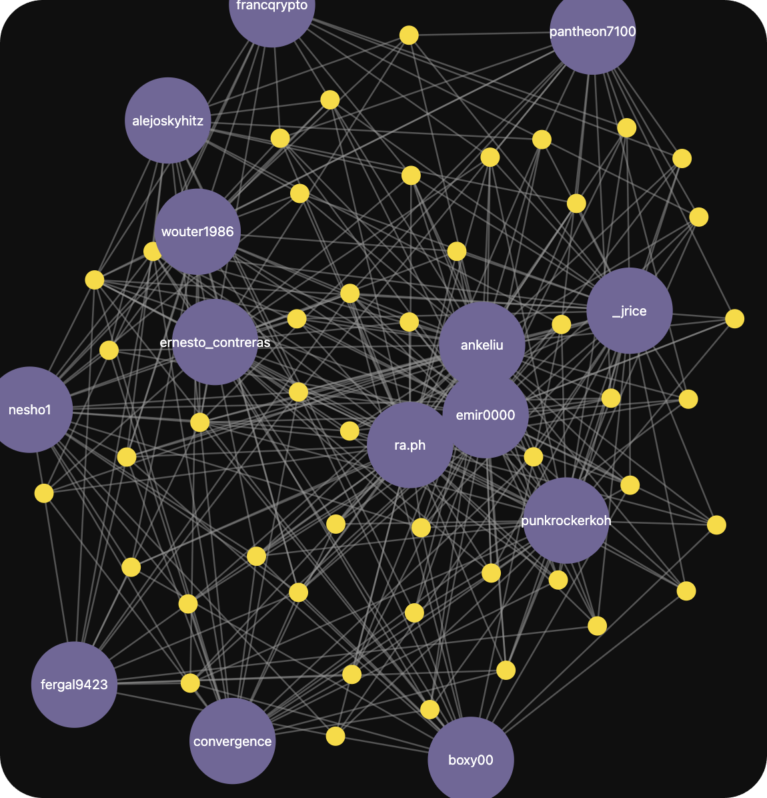

```
status: Draft
submit: 14 Aug 2025
dialog: https://github.com/stellar/scf-verified-bot/discussions
```

# 🪔 How can we pour gasoline on fiery innovator passion?

Hello hello!

This post responds preliminarily to points [brought up](https://github.com/JFWooten4/notes/blob/ebbcd987f9239b28ec5cbdf9830a4bc08637ceb6/2025/Jul/11.md) last SCF Structure meeting. I asked for a public place to submit efforts, and after some contemplation I couldn't think of a better place to write than this exceptionally underappreciated repo!

All around, some exceptional work here from @silence48 in #1.[^cf-next] 🎉 Sincerely cannot wait to see what comes out of the brewing pot next from @ankeliu and team.

### Upgraded Visuals

Speaking of, I'd like to highlight the awesome new "delegate activity graph" within the Dashboard. Exceptional look with the crystal-clear transparency reminiscent of Stellar Atlas prototyping:

[](https://communityfund.stellar.org/dashboard/voting-history)

All these developments are incredible to say the least, and I really can't wait to see more work published.[^legacy-data] If there's anything I've noticed working with SDF changemakers it's immense technical dedication.

### Continuing Excellence

That's why I've been mapping out the application of NQG to our [nonprofit community](https://www.whydrs.org/the-first-duna) since its ingenious inception and publication. I can't think of a better testing ground "in the fire" of Sybil and reputational attacks than the Community Fund.[^asets!]

I trust this community with my everything. There's not a single thing I wouldn't give to see us succeed in our just cause. That conviction and dedication can't be "bought" with singular development grants.

Through the DRS movement to fight Wall Street corruption, I've seen just the most amazing facets of this communal effort based on shared values. And, critically, it's something very fragile which requires nurturing and supportive environments. We have for the first time the chance to give this power away.[^fluttercard]

### Decentralizing Capital

We're a far cry away from the network's original vision of distributing the lumens equitably across everyone. We're now working with a legitimate form of capital practically acceptable by anyone. This reality forces an immense amount of responsibility onto the SDF which must "rightly" allocate everything while acting [largely alone](https://github.com/stellar/stellar-docs/issues/794).[^round-37]

I know how hard that role can be, as it's driven me to focus so much on "10Xing" that I ignored the innovators right under my nose. It's just too much responsibility, and it can blind you to incredible potential blossoming under thick canopies of deafening silence and doubt.[^joahn0ask] Capital to bring in help, capital to move groups forward, and capital to turn dreams into catalysts—it's all at stake when we leave proven community members alone in a race towards mediocre work to foot the bill of our visions.

I've observed challenges in capital allocation in the Fund and a plethora of other venues, either personally or through direct leadership connections. There's so much we already have that brings full-time contributions without formal working arrangement.[^meetings-gitbook] How can we support sparks in the community that are too weak or timid to succeed in the legacy structure?


[^meetings-gitbook]: I know how tempting it can be to seek immediate control over development narratives, especially when you've put so much into crafting the system itself. But we need others to recognize our shared goals, and a lot of those community members may not be comfortable popping into a synchronous voice call. Could we release the meetings through a GitBook tab like [here](https://developers.stellar.org/meetings/2024/01/26) so that new members aren't begging for manual details?

[^joahn0ask]: @johansten comes to mind as someone who's developed so much for the ecosystem held back by a lack of perhaps the most important tool: capital. With so much independent self-inclined action at stake, I appreciated his [perspective](https://discord.com/channels/761985725453303838/1396309530228559872/1404582856570699826) on recent funding developments elsewhere [advocated](https://discord.com/channels/897514728459468821/1124340476288454657/1395859048020185098). They're someone I'd love to discuss nuances with tomorrow, but they will likely need either extremely good meeting notes or a recording given their very different timezone.

[^round-37]: I wonder what our developments could look like with an inclusive process that recognizes the value of independent community lumens distributions. Might informated local trading overcome the stifling wall of asking permission? What if the community could play the same game as certain SDF visionaries tasked with discovering ideal opportunities through impossible delegation structures?

[^cf-next]: I'm not sure what the plans are "behind the scenes" with getting this merged and bringing other community-site assets online through the GitHub. I do appreciate that it's easier to "move fast" with a closely-held agenda, but I believe in collective intelligence when it comes to our shared software.

[^legacy-data]: And to see all this despite some legacy [migration constraints](https://discord.com/channels/897514728459468821/1124340476288454657/1264660553138176032). I can only hypothesize how much time everyone spends in AirTable.

[^asets!]: I'm an asset management guy forged from the depths of capitalist markets. That's why my main indicators of systemic competence revolve around total funds secured and distributed by systems.

[^fluttercard]: _See, e.g.,_ @christian-rogobete's exemplary work affirming [community contributions](https://github.com/Soneso/stellar_flutter_sdk/pull/68#issuecomment-1645236102) through supportive remarks not broadly seen in open-source work which treats people like machines following monetary orders. Soneso even goes so far as to [merge](https://github.com/Soneso/stellar_flutter_sdk/pull/69) mistakes without judgment which can so often discourage open participation and voicing of one's true feelings. 💜
