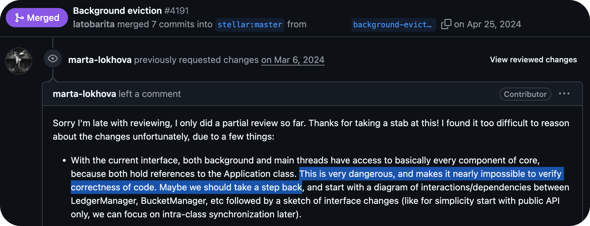

```
Status: Review
Submit: 20 Oct 2025
Dialog: https://groups.google.com/g/stellar-dev/c/ZmlSKP1HoDc & https://groups.google.com/g/stellar-dev/c/LwXFzRFjW1o
```

## Context

The present submission panel for the public goods award goes through three SDF individuals, which is centralized. I want to get us on track to expand power over common Foundation-run assets. This starts with bringing the ecosystem into the loop for co-advancement discussions over and above validator votes.

### Means

Submitted through 'John' username using personal domain Google account.

### Background

Tomer is a great developer, and I can think of only a few other equally competent leaders at the Foundation's review helm. That said, a lot of my perspective here came from our [first interaction](https://developers.stellar.org/meetings/2024/01/26) (at 8:26 to 21:00) where he presented the view that "software [even Bitcoin] has bugs." I don't think this is an acceptable standard of care for something that has coordinated development efforts like our core work.

Relations continued separating during [AMM discussions](https://wooten.link/1558) when Tomer claimed Routers could solve all the problems of disparate liquidity. This is not acceptable for a myriad of reasons, and I would like more work done to get contracts invoking the native DEX. This was [flatly denied](https://discord.com/channels/761985725453303838/1302004423483981924/1302299862359867492) in a very respectable public quorum prior to [migration flaws](https://aqua.network/governance/proposal/104).

I am making extensive efforts to dissociate from this back and forth in the past and focus on [matters at hand](https://fxtwitter.com/tomerweller/status/1978941116683567337). But these changes introduced a belief. I understand from leadership that people like myself who care about decentralization are "resistant to change" and just afraid something new will come along. This is more than holding on to how things were, it's months of compliance work.

## Emails

### CAP Team

I think the quality of feedback on CAPs matters a lot, since the committee is the last line of review before validator implementation. Whether we like it or not, the archival inconsistencies showcase general deferment to CAPs that make it through FCP, introducing risks despite the network's "feature completeness." The original post said "starting with SDF's representation" in an idea to "evolve the CAP process" to presumably include agents outside of the Foundation, which seems like a great idea given productive public forums to perfect developments responsibly.



I've discussed this with prominent community members, and I think we should expand this three-person group to include independent members who will consistently choose quality over adoption speed. Just as my concerns over the Protocol 20 bug took time to mature by a quorum, I prefer adequate public documentation over the [24-hour turnaround](https://groups.google.com/g/stellar-dev/c/osfwam2kUjo/m/4aiTqTh8EgAJ) on 62 and 66 which were exploited in a month. If the vast holdings of lumens aren't enough incentive, then I would not trust complete power in the hands of Foundation members given the org's relative uniformity of viewpoints which often seem lodged deep within opaque Slack chatter.

Blockchain should not update such critical governance mechanisms [within 3 hours](https://github.com/stellar/stellar-protocol/pull/1792) of proposal based only on the response of David's email. Might it be worth spending more than a few days approving these changes to receive enhanced written feedback from exceptional community members like Tim Baker or Johan Stén? I've risked my entire career on the decentralization of the network as a requisite to trade securities, and over the years of developing our frameworks we've always found stability in the structure of giving others who care the ability to make their concerns known and recognized in roadmapped efforts.

John

### SEC View

For clarity of documentation, the majority of public information announced about this exploit can be found in [this thread](https://fxtwitter.com/JrBaruc/status/1979213431615218171). As for the naming chat, I propose we call the interim P24 upgrade "Xanthan" for a niche keto thickening agent. I add just a pinch to harden up an otherwise unstable liquid mixture so that it bakes together just right.


A little community prudence has gone a long way fixing [past bugs](https://stellar.org/blog/developers/our-decision-to-disarm-validators-and-vote-to-postpone-the-protocol-20-upgrade), and I can't do my job with the alternative of code reviews by [one person](https://github.com/stellar/stellar-core/pull/4767) who authored the [original logic](https://github.com/stellar/stellar-core/pull/4610). I hope we can walk away from this incident with a little more humility and deference to community developer conversations. In past meetings, little written preparatory materials and domineering controls make it hard to express live dissent or question methods.

For instance, the related [CAP66](https://youtu.be/JDlIL5y5bn8) and [CAP62](https://youtu.be/u204TwiHJpE) discussions were not open-mic for input from developers, being just a single monologue in the latter at ignorance of the wisdom of our impassioned developer community. How may we incentivize and promote more ecosystem involvement above and beyond validator voting, since diverse viewpoints and increased eyes make bugs much more shallow than this? My industry was riddled by fraud because of loopholes introduced during crises, which mimic central viewpoints apparent in TODOs and clear syntax change needs just a couple of days before the proposed hasty upgrade.

In good faith,

John Wooten
