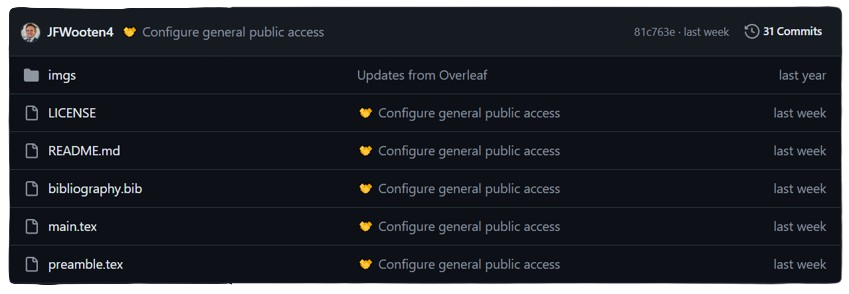
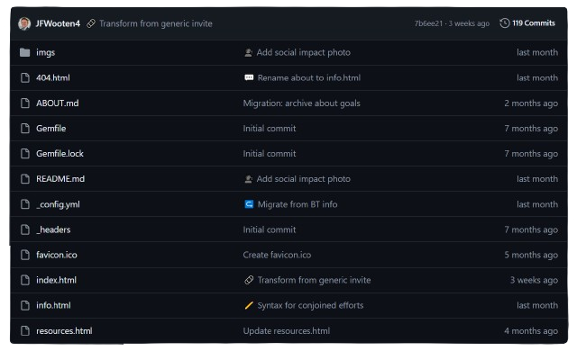

I made a silly mistake recently which created a messy git repo. I thought this would be fine because other people / myself would continually update the more active documents, but looking back this was fairly short-sighted/aggressively long-sighted because there probably won't be many changes for some time.[^bib] Let me explain.

[^bib]: Namely, I doubt any new sources will be added as references imminently.

# Bulk Git Commits

It's common[^src] for contributors to collate diverse changes into a single commit for the sake of simplicity, ease of writing less, etc. Take your motivations as you will. I've personally found that it's the easiest way to obfuscate otherwise material information / nuanced details.

[^src]: I won't bother sourcing major offenders as that is not particularly respectful; most people are really trying their best. Moreover, a lot of changes come in through a PR whereby the admin opts for using the PR name rather than rebasing with individual commits.

But the other week, I accidentally [did this](https://github.com/blocktransfer/yellowpaper/commit/81c763ed256f9ab0e23bbaff7d98dfef215205c9) in an update to the YP. I like using the handshake emoji for the LICENSE file since it rarely changes unless you want to keep the copyright year current. But when I added this to the repo, I also made a number of minor updates to all the non-image files in the repo.

Accordingly, the view here now looks relatively trashy:

# Rebase and Merge 🙏

However, more relevant to adequate public disclosures, the logic behind the changes to each item is not properly documented. Namely, I filled in a gap on the third page that's existed for at least a year. This change, alongside the explicit reference to the Stellar dev docs, should have been documented in the commit name or details regarding `main.tex` specifically&mdash;and they weren't.

In a perfect world, each category of change would have its own commit detailing the inspiration, motivation, and significance of the change. Not only does this create a prettier repo (below)[^whop], but it lets anyone easily see what's happening with their favorite projects without diving into the complexities of source code. And I beg you: this is web3 we're talking about; could we please keep things mildly interesting with an emoji?

Emojis let you add valuable context that would otherwise necessitate a bland tag. Consider a 🐛 instead of `bug:`, 🔨 instead of `fix:`, etc. It's a quick [keyboard shortcut](TODO_WRITE_ARTICLE_ON_HOW_USE_EMOJI_SHORTCUTS) and search that really only takes a second even though it adds so much appeal. <!-- lol -->

[^whop]: The hasty `Update resources.html` was a [quick fix](https://github.com/JFWooten4/JFWooten4/commit/2fcfedad073958a44bbd3034c3e2c58ac9e734a6) after [updating](https://github.com/JFWooten4/JFWooten4/commit/4436b5c81dd50f8f5ad8d142bd69bfcc3dd985bb) the page's redirect URL. By not following my own convention,[^tst] I drastically limited the valuable public disclosure, auditability, and transmission.

[^tst]: Four descriptive words after an emoji, with additional context in the description. _See, e.g._ conversation not documented publicly which can now be referenced in [compliance update](https://github.com/blocktransfer/website/commit/e6b2c675063c7702817e1276d0311e4cac4207d7). These backhooks have material implications in streamlining, facilitating, and provoking permissionless innovation.
